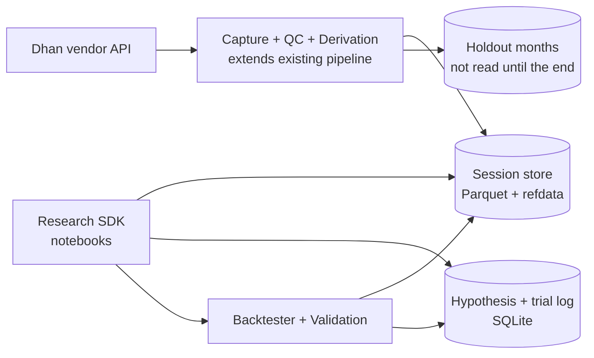
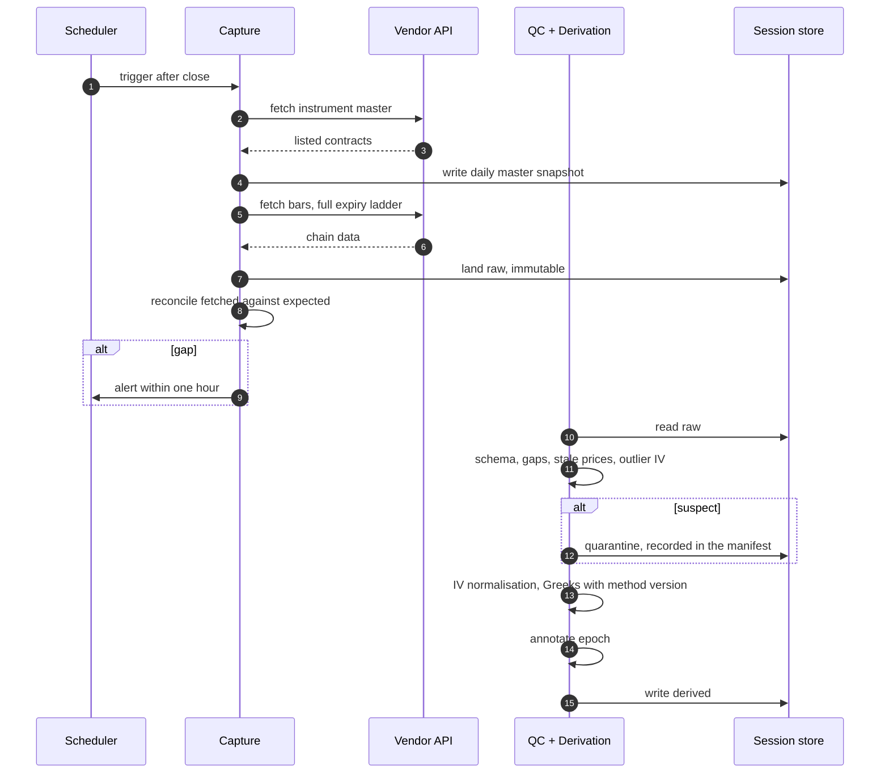
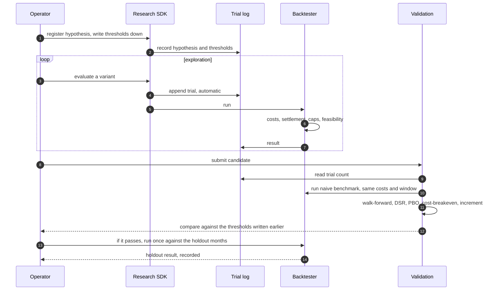

# MVP — Build Specification

| | |
|---|---|
| **Version** | 0.1 |
| **Status** | Proposed — for owner approval before build |
| **Date** | 12 August 2026 |
| **Parents** | FRD v0.5 · HLD v0.6 · Data Platform Analysis v0.1 |
| **Supersedes** | `POC_Build_Spec.md` — renamed and cut, see §8 |

---

## 1. What this is, and the discipline that shapes it

This is the **first shippable version**, not a proof of concept. A POC proves a point and gets discarded; an MVP runs, produces results you act on, and evolves. Everything deferred below is deferred *into* the evolution path, not out of scope.

**The question it answers:**

> Can we discover a statistically credible, economically meaningful and executable options edge in Indian F&O — and can we tell honestly whether we have?

**The loop that must close:**

```
capture → QC → derive → hypothesis → signal → backtest → validate → decide → holdout check
```

### 1.1 The membership test — one exception, not a list

Everything in this build satisfies one of two conditions. Nothing else gets in.

1. **The loop does not close without it.**
2. **It is permanently lost if deferred.** Not "harder later" — *impossible* later.

That second condition is far narrower than it was in earlier drafts, and applying it honestly removed most of what those drafts called mandatory. **A control that can be added in month six should be added in month six.**

The reason this test matters more than any individual requirement: the specification went through five review rounds while nothing was built. Each round found real defects, and the specification still grew faster than the system. **Infrastructure completeness is not progress**, and the MVP is where that gets enforced rather than restated.

### 1.2 What survives, and what waits

| Survives | Why it cannot wait |
|---|---|
| **Prospective capture, widened scope** | A month not captured is gone permanently. The canonical irreversible case |
| **A plain trial log** | Trials not recorded cannot be counted later, and every deflated statistic computed afterwards is then wrong by an unknowable amount |
| **Thresholds written down before the run** | You cannot retroactively claim you pre-registered |
| **A holdout: months you simply do not touch** | Cannot be unseen once looked at |
| **Raw kept, never overwritten** | Nearly free — "write new files", not a versioning system |

| Deferred | Why it can wait |
|---|---|
| Hash-chained ledger, tamper-evidence | The unprotected period is the MVP, when nothing is at stake. Start chaining when something is |
| Identity model, principals, authenticated API | One operator, no agents yet. Add when agents arrive |
| Holdout sandbox, result minimisation | Machinery to enforce a discipline that, at one hypothesis, you simply follow |
| Data versioning, as-of queries, invalidation | Re-run everything on change. Cheap at this size, and the comparability problem only exists with multiple live candidates |
| Regime, allocator, AI layer, CPCV, feature store, forward test, monitoring | None of it moves the question one inch |

**The test each deferral passes:** it can be added later at roughly the same cost as building it now, and its absence does not make the MVP's answer untrustworthy.

**One line held deliberately: capture scope stays wide.** Not for elegance — because "we'll widen it later" means the data for those months never exists. It is the only place where scope and irreversibility coincide.

---

## 2. Scope

**Underlying:** NIFTY. **Anchor hypothesis:** H1, the index variance risk premium — the only Grade-A catalogue entry with India-specific evidence, and it has a natural naive benchmark. **Mode:** backtest only.

### 2.1 The honest limitation, stated up front

**There are no realised fills, so the cost model is a documented assumption, not a calibration.** Consequently the **cost-breakeven multiple is the headline number, not the Sharpe** — "how wrong can my cost assumption be before this edge disappears" is the only honest question available when the assumption is unvalidated. A result that survives only at optimistic costs is reported as **not evaluable**, not as a pass.

This is not fixable within the MVP. It is fixable only by trading, which is what the MVP exists to decide.

---

## 3. Components

Six, down from eight. Each carries acceptance criteria that are testable.

### C1 — Capture, widened *(starts first; every day of delay is lost history)*

Extends the existing Dhan pipeline rather than replacing it — it already works, is tested, and runs nightly.

**Changes needed:**
- **Full expiry ladder**, not front-weekly only. `expiry_code=1` is currently hardcoded, which makes term structure, calendar spreads and the 1DTE-overnight hypothesis structurally untestable.
- **A configuration surface.** There is none today — strike range, expiry scope and underlyings are module constants.
- **Data-driven expiry rules.** The Tuesday rule is hardcoded with a docstring warning that pre-September-2025 backfill produces wrong expiries. This blocks the historical backfill and fails *silently* — the convergence check only fires on sessions that are the derived expiry day.
- **Single onboarding point** for underlyings, currently duplicated across two modules.

| Acceptance |
|---|
| Full listed NIFTY chain captured across all listed expiries, verified against the daily instrument-master snapshot |
| Expiry derivation reads a dated rule table; a pre-Sep-2025 session derives Thursday, a post-Sep-2025 session derives Tuesday |
| Capture scope is configuration, not code |
| Gap alert within one hour of close |
| Re-running a session does not overwrite raw |

### C2 — Session store

Parquet per session per underlying, plus the refdata sibling the backtester already consumes. **No versioning, no as-of queries** — the store holds current data and re-runs regenerate.

| Acceptance |
|---|
| A backtest resolves (underlying, date range) → files, and reports missing sessions rather than silently skipping |
| Raw is immutable; derived is regenerable from raw plus a recorded derivation version |

### C3 — QC, derivation, epochs

Existing checks retained. Additions: **epoch annotation** on every result, and **refusal to run a window crossing an epoch boundary** without recorded justification — this is on the honesty path, not the loop path, because any 2023–2026 window necessarily spans the October and November 2024 and September 2025 breaks.

| Acceptance |
|---|
| Outlier detector fires on a seeded fault, does **not** fire on a known-clean control |
| Quarantined sessions are recorded — the manifest currently reports zero while 53 orphan quarantine files sit on disk |
| Every result is annotated with the epochs its window spans |
| Greeks carry a **method version**, so a later change is detectable |

### C4 — Hypothesis record and trial log

A hypothesis record with the fields that do work — mechanism, null, predictors, thresholds — and a **plain append-only trial log**. Every SDK evaluation logs automatically.

Not hash-chained. Not tamper-evident. Those defend against a future operator with something at stake; in the MVP there is nothing to gain by editing a row.

| Acceptance |
|---|
| A record without a mechanism, a null or written thresholds is refused |
| Every evaluation appears in the log, including from a notebook |
| Trial count is read from the log, never supplied by the caller |

### C5 — Backtester

Full Indian statutory cost stack at date-effective rates, European cash settlement on the last-half-hour average, participation caps against volume and open interest, feasibility verdicts, simplified margin.

| Acceptance |
|---|
| Statutory costs match hand-computed values on a fixture spanning the 1 Oct 2024 STT change |
| Expiry settles against the stored formula for that date |
| Participation caps bind and the resize is recorded |
| Every entry and exit carries a feasibility verdict — could this have been filled, distinct from what it would cost |
| Re-running the same inputs reproduces the result |

### C6 — Validation and decision

Walk-forward, deflated Sharpe using the log-derived trial count, probability of backtest overfitting, cost-breakeven, tail metrics, and the increment over the naive benchmark — risk-matched, not raw P&L, since a conditional signal trails an always-on benchmark on raw returns however good its timing.

Thresholds are **written down before the run**. At one hypothesis that is a file, not a locked ledger.

| Acceptance |
|---|
| A known-overfit synthetic strategy is rejected; a known-genuine one passes |
| DSR uses the log-derived trial count |
| Cost-breakeven is reported on every run |
| The naive benchmark runs under the identical cost model, data and window |

**The holdout** is the most recent *N* months, which nothing reads until the end. When a candidate has passed everything else, run it once against those months and write down what happened. No sandbox, no access control — just months you have not touched, and the discipline not to touch them.

---

## 4. Design

### 4.1 Components



*Diagram 1 — MVP components. **Legend:** rectangles = processes, cylinders = stores. The holdout is a separate store written by capture and read only at the end — enforced by discipline in the MVP, by access control later.*

### 4.2 Daily capture



### 4.3 The research loop



---

## 5. Build order

Sequenced by irreversibility, then by the loop.

| # | Milestone | Contains |
|---|---|---|
| **0** | Widened capture running | C1 — before anything else, including before the rest is settled |
| **1** | Holdout months set aside | Cannot be unseen once looked at |
| **2** | Store and trial log | C2, C4 — the log must exist before the first trial |
| **3** | Honest data | C3 |
| **4** | The loop | C5 |
| **5** | The decision | C6 |

If the build stops after milestone 3, the captured history and the untouched holdout still have value. Nothing before milestone 4 is wasted.

---

## 6. Done means

The MVP is done when it has produced **one decision on H1**, and the operator can say which of these happened:

| Outcome | Next |
|---|---|
| Passes, and survives the holdout | Forward test — where the cost model starts calibrating against real fills |
| Fails a threshold | Next hypothesis. The loop works |
| Passes, fails the holdout | The most valuable outcome: the in-sample machinery was insufficient and the holdout caught it. Tighten before spending more research |
| Not evaluable | Survives only at optimistic costs, or feasibility failures dominate. The answer is about *execution* — resolve the quote-data question before continuing |

**It fails only if nobody can say which of the four it was.**

---

## 7. Evolution path

Deferred items, and the signal that it is time to build them. This is the difference between an MVP and a POC — nothing here is discarded, it is scheduled by evidence.

| Add | When |
|---|---|
| Data versioning, invalidation, comparability refusal | When two or more candidates are compared and re-running everything gets expensive |
| Hash-chained ledger, tamper-evidence | When a result is worth defending — real capital, or a second person |
| Identity model, authenticated API, holdout sandbox | When autonomous agents run research |
| CPCV, feature store, surface fitting | After the first passing result, when in-sample rigour becomes the binding constraint |
| Forward test, monitoring, feedback | When a signal is promoted |
| Regime layer | Only after its horse race says continuous conditioning loses |
| Allocator beyond fixed weights | When two independently validated signals exist |
| AI research layer | When the loop is fast enough that generation is the bottleneck |

---

## 8. Changes from the POC draft

Renamed, and cut. The prior draft carried eight components and machinery this one defers: hash-chaining, the holdout sandbox with result minimisation, the identity model, and point-in-time data versioning with as-of queries.

Each was removed against the §1.1 test, and each removal has the same justification: **it can be added later at roughly the same cost, and its absence does not make the MVP's answer untrustworthy.** The prior draft's own reasoning for keeping hash-chaining — that retrofitted chaining cannot protect earlier rows — is true and irrelevant, because the unprotected period is precisely the one where nothing is at stake.

What did **not** get cut: prospective capture and its widened scope, the trial log, thresholds written before the run, the untouched holdout months, and raw immutability. Those are the irreversible five.

---

## 9. Open items that gate the build

| Item | Blocks | Needed by |
|---|---|---|
| Vendor capture feasibility and rate limits at full-ladder scope | C1's design | **Milestone 0** |
| History depth available for backfill | Holdout span — set at milestone 1 and not re-cuttable | **Milestone 1** |
| Quote-data availability | Whether "not evaluable" is resolvable at all | Milestone 4 |
| Epoch dates verified against primary circulars | C3 | Milestone 3 |
