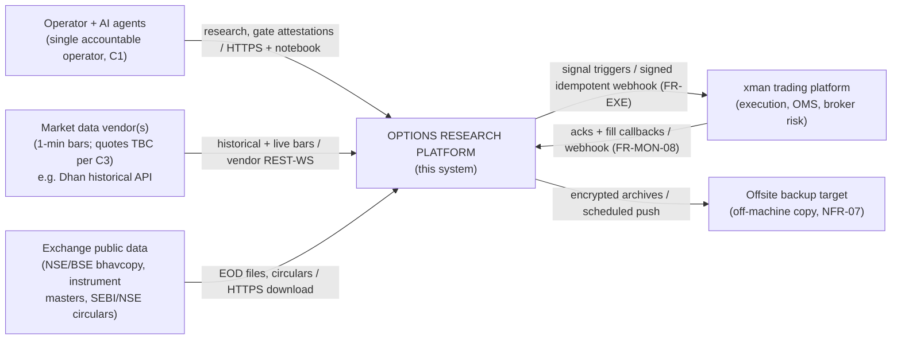
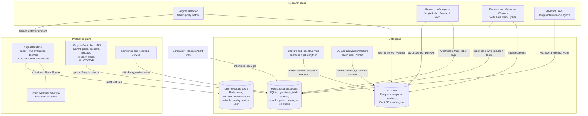
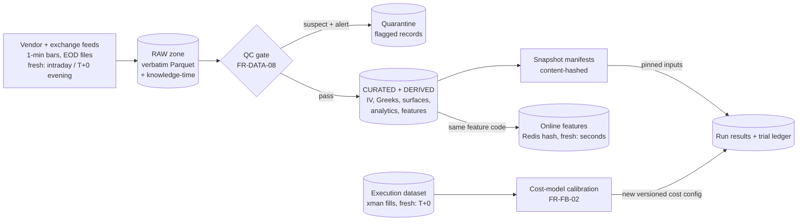
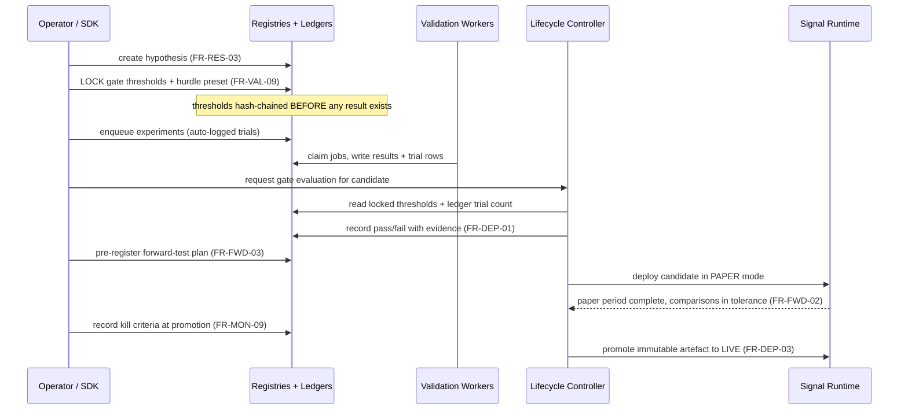
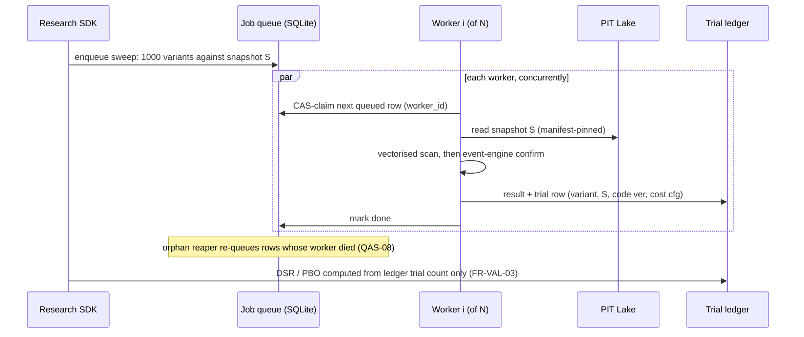
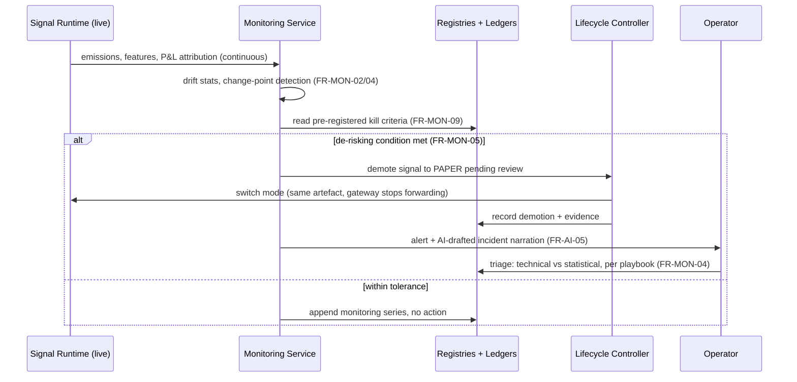
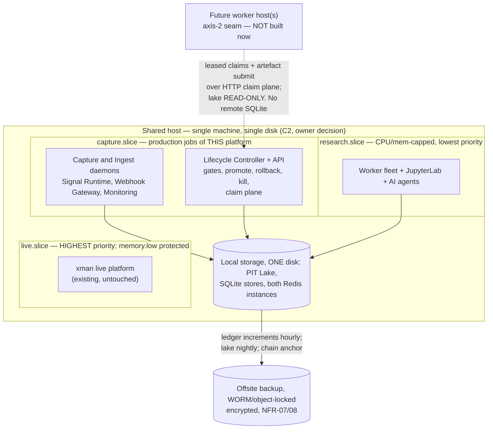

# Options Trading Research Platform — High Level Design

| | |
|---|---|
| **Version** | **0.6** (root-cause revision) |
| **Status** | Proposed — for owner review against FRD v0.5 |
| **Date** | 12 August 2026 |
| **Baseline** | FRD **v0.5** (root-cause revision, Aug 2026) — `Options_Research_Platform_FRD.md` in this repository; constraints C1–C7 binding |
| **Audience** | Platform owner/operator; AI implementation agents; future reviewers |
| **HLD/LLD line** | This document decides **containers (things that run or store data), dataset lifecycles, the port/adapter seams, and irreversible technology choices**. Schemas, table DDL, API signatures, class design, configuration formats and per-component algorithms are LLD, to be recorded as ADRs and phase specifications as each component enters build. |

## Revision history

| Version | Date | Summary of change |
|---|---|---|
| **0.6** | 12 Aug 2026 | **Root-cause revision, mirroring FRD v0.5.** §9.1.1 answers the question v0.5 left open — *who executes the holdout evaluation*: a **Holdout Evaluation Sandbox** in the capture slice under the `promotion` principal, with no network egress, no write path to research-readable locations, and **only the pre-registered metric set leaving it**. Result minimisation is what closes the exfiltration channel; the mount permission never did, because the evaluation is a backtest of researcher-authored code whose persisted equity curve and trade log are a projection of the holdout itself. Sealed-zone derivation moves to the capture slice so the holdout is QC'd through the same pipeline as in-sample data. §9.1.2 states what the seal does **not** cover — the live-observed, monitoring and execution families span the same dates and are research-readable. §11.1 adds the identity model: six principals, default deny, an authenticated operator API, and the operator credential held **outside** the research slice — the only mechanism that distinguishes the operator from the operator's agents, and without which the AI information boundaries are unenforceable. The threat model gains a holdout row stating honestly that the operator with root cannot be prevented, only detected. **Corrections:** four stale statements of NFR-01 replaced by the run manifest; QAS-06's tactic no longer mandates the physical separation AD-20 records as unavailable; the Lifecycle Controller concentration risk is **actually recorded in §17** — §8.5 asserted it was and it was not — with the gateway's fail-closed behaviour defined; header and scope line corrected from FRD v0.2 and 12 modules. |
| **0.5** | 12 Aug 2026 | **Structural controls given architecture.** FRD v0.4 added controls that are *access boundaries and artefacts*, not computations, so they land here rather than in a worker: §9.1 adds the **sealed holdout zone** — a lake partition the research slice cannot read, enforced by OS-user and mount permissions rather than by policy, since the platform runs autonomous agents with lake access and a rule they are asked to respect is not a control. The **run manifest** replaces the five-element identity tuple as the reproducibility key, because the tuple omitted the numerical environment it implicitly promised. **Replay verification** is added to the Signal Runtime, which the live-observed dataset already made possible. Campaign records and mechanism-family budgets extend the Registries. The allocator is reduced to fixed weights plus caps until two validated signals exist, and the Regime Detector container moves to Phase 2 at the earliest. |
| **0.4** | 12 Aug 2026 | **Hypothesis engine absorbed.** FRD v0.3 consolidated the hypothesis engine into the requirements baseline; its eight requirement modules had no owning container here. §8.5 added, assigning them — **two new containers (Regime Detector, split training/inference; Allocator, inside the Lifecycle Controller because it gates live emission), with the remaining six modules extending existing containers rather than adding their own.** Records the impact on four existing components: the workers gain a leakage detector, a naive-benchmark harness and a physical-measure simulated null while **losing the gate evaluator** to the Lifecycle Controller; the controller becomes the platform's busiest component and its widest blast radius; the Signal Runtime gains causal regime inference and the exposure multiplier; Monitoring gains the multiplier itself as a second subject, since nothing otherwise watches a control that only ever reduces exposure. Container diagram updated. |
| **0.3** | 11 Aug 2026 | **Second review round (Fable) + two owner decisions.** *Owner decisions:* capture phased to indices first with stock underlyings deferred, recorded with permanent-forfeiture-of-history as accepted risk (AD-21); single host / single disk confirmed, so live-trading IO protection is not structural — residual risk accepted with four compensating controls and a named dedicated-disk revisit trigger (AD-20). *Critical fixed:* §8.2 had sized a 10-underlying index corpus while the FRD scopes index **and** stock derivatives (180+ NSE underlyings); sizing now states both scopes, and capture feasibility against vendor rate limits is raised as an open item. *Majors fixed:* claim plane respecified by responsibility with leases, an artefact path and a separate worker identity (AD-23); Lifecycle Controller added to the deployment diagram — previously in no slice — and the claim arrow repointed to it; gate evaluation made the Lifecycle Controller's alone so the container computing a result never judges it (AD-22); Universe Resolver settled in the PIT Lake; backup anchor target now **must** be write-once, with a threat model naming the operator's future self as primary adversary (AD-24); hourly ledger increments added so QAS-09's 1 h RPO has a mechanism; hash-chain continuity reconciled against monthly-rolling stores; four unowned requirements given owning blocks — FR-VAL-08 leakage detector, FR-BT-02 statutory cost schedule, FR-FWD-01 paper fill simulator, FR-SIG-01 online feature writer; DuckDB justification corrected from ASOF join to knowledge-time version resolution, with the spike rewritten to test the right query shape; compaction designed rather than assumed away (AD-25); schema evolution and the platform's own SDLC added (AD-26). *Self-correction:* §7.8's Tier-2 arithmetic is now derived rather than asserted, and states plainly that its 3 min/path assumption is unsupported for the positional strategies tiering exists to serve. |
| **0.2** | 11 Aug 2026 | **First review round.** Replaced the axis-2 scale seam: SQLite CAS queue over a shared network mount was invalid (fcntl locking is documented as broken on NFS; a CAS claim is read-modify-write; the same file family holds the hash-chained ledgers) — superseded by an HTTP claim plane (AD-04a). Added the two-tier validation protocol after the CPCV compute plan was shown not to close, and because the vectorised backend's speedup does not apply to positional strategies (§7.8, AD-17). Separated code parity from data parity: added the live-observed dataset family and corrected AD-06's overclaim (AD-18). Split Redis into production and research instances so the live path's inputs are not writable by autonomous AI agents (AD-19). Added physical-separation guidance for live-trading protection, cgroup IO control being the weak controller (AD-20). Mandated SQLite backup via the backup API or `VACUUM INTO` rather than file copy, a ledgers-then-lake backup ordering, and a non-blocking trial-ledger write path. |
| **0.1** | 11 Aug 2026 | Initial high level design against FRD v0.2. 18 sections; 7 diagrams (4 block, 3 sequence); 13 containers; 12 quality attribute scenarios; 16 architectural decisions; bidirectional requirements coverage for all 12 FR modules and NFR-01…10. |

---

## 1. Purpose, scope and readership

This HLD is the architecture that satisfies FRD v0.5 in full — all 20 FR modules and the NFR set — under constraints C1–C7. It decides:

- the storage paradigm and the point-in-time/reproducibility mechanism (the platform's defining property, NFR-01);
- the compute and orchestration model, including how sweeps and CPCV scale;
- the cost-model abstraction that keeps both branches of FR-BT-03 behind one interface (C3);
- the three-mode signal-parity mechanism (FR-SIG-04);
- placement and partitioning on hardware shared with the live xman trading platform (C2, NFR-09);
- the seams at which each of the three owner-selected scale axes grows without redesign.

It defers to LLD/ADRs: dataset schemas, registry table designs, the signal contract's field-level definition, the SDK API, gate-threshold file formats, the margin engine's internal methodology, and all library-version specifics.

Requirements are referenced by ID throughout and **not restated** — the FRD owns their text.

## 2. Summary

The platform is a **file-first, single-host research factory with named scale-out seams**. Market and derived data live in an immutable, bitemporal Parquet lake queried through an embedded as-of engine; all registries and ledgers (hypothesis, experiment/trial, signal, epoch, gate) live in append-only, hash-chained SQLite stores; compute is a fleet of stateless workers claiming jobs from a SQLite queue by compare-and-swap — xman's proven pattern. One signal artefact runs unmodified in backtest, paper and live modes behind port/adapter seams, which is how research/production parity (FRD principle 2) is achieved structurally rather than by monitoring. Everything time-related runs on xman's `EngineTime` discipline, which is what makes replay determinism and NFR-01 reproducibility possible.

The three decisions that matter most: **(1)** no database servers — Parquet + SQLite + an embedded query engine, so reproducibility is file identity and backup is file copy; **(2)** the cost model is a **port** (`ICostModel`) with spread-based and fills-calibrated implementations selected by versioned configuration, so C3's unresolved data question never touches calling code; **(3)** research runs in a subordinate resource partition on the shared host, with live trading protected by an enforced scheduling hierarchy, and scale-out happening by *adding workers against the same lake and queue*, not by re-platforming.

The biggest risk: the honesty of branch (b) of the cost model (fills-calibrated) and the compute cost of arbitrage-free surface fitting — both flagged as spikes in §17, neither on the critical path of the Minimal Credible Core.

## 3. Goals and non-goals

**Goals**

1. One honest experiment end-to-end (the FRD's MCC) on hardware shared with live trading, with nothing about the design needing rework as Phases 1–3 layer on.
2. Reproducibility as a *structural* property: any recorded result regenerable exactly from its **run manifest** — NFR-01, FR-BT-06.
3. Anti-overfitting controls enforced by the pipeline (trial ledger, locked thresholds, deflated statistics), not by operator discipline — FRD principle 1.
4. Growth without redesign on the three owner-selected axes: data history, research throughput, signal book size.
5. Maximum reuse of xman technology and patterns; every departure named and justified (§7, §14).

**Non-goals** (binding; from FRD §1.2.1 and constraints)

- No order management, broker-layer risk enforcement, or execution logic — xman owns these.
- No multi-user workflow, entitlements, or second-approver gates (C1). Gate integrity comes from pre-registration + tamper-evidence, and this HLD contains no user-management component.
- No order-book/microstructure capture, no sub-second signal generation, no RL execution agents.
- No tick-data schema commitment (C5): tick-compatibility is weighed where free (§9 partitioning choice), never paid for.
- No high-availability/clustering goal. The availability target is "survives restarts without loss or duplication" (NFR-04) plus rehearsed restore (NFR-07), not always-on.

## 4. Context and scope

*Diagram 1 — System context. **Type/scope**: C4 level-1 context, whole system. **Legend**: rectangles = external actors/systems; the bold-labelled box = the system under design; arrows = data/control flow, labelled `intent / protocol`, direction = flow of data. Acronyms: OMS = order management system; C1/C3 = FRD constraints; FR-EXE/FR-MON = FRD modules.*

| External entity | Direction | Interface | Notes |
|---|---|---|---|
| Operator + AI agents | in/out | Notebook workspace, research SDK, dashboards, gate attestations | The only human. AI agents act through the same SDK and registry, never around them (FR-AI-02/03/07). |
| Data vendor(s) | in | Vendor REST/websocket; 1-min bars baseline (C4) | Vendor choice and quote availability (C3) are open items; the ingest boundary is an adapter so either resolution is absorbed there. |
| Exchange public data | in | HTTPS file download (bhavcopy, instrument masters, circulars) | Reconciliation baseline (FR-DATA-01) and epoch-registry evidence (FR-DATA-16). |
| xman platform | out/in | Signed, idempotent webhooks out (FR-EXE-01…04); acks and fill callbacks in (FR-MON-08) | Interface-level integration only; deliberately Phase 3. HTTP only — never a Python import, mirroring the xman/ui boundary rule. |
| Offsite backup target | out | Scheduled encrypted push | NFR-07/08. **Must support write-once retention (object lock / WORM) or an independent timestamping authority** — the vendor is LLD, that property is not. A mutable target defeats NFR-08 entirely: anyone able to rewrite a ledger can rewrite the anchor beside it and recompute the chain end-to-end. See the threat model in §11. |

## 5. Constraints and their design consequences

| Constraint | Consequence in this design |
|---|---|
| **C1** single operator, AI-assisted | No auth/entitlement subsystem. Gate approvals are self-attestation rows in the hash-chained gate ledger (§9, NFR-08). AI agents are peers of the operator *inside* the pipeline: same SDK, same auto-logging, same gates. Component count is deliberately low — every container is one more thing a single operator must keep alive. |
| **C2** shared infrastructure | One host, partitioned by an enforced scheduling hierarchy (§11): live trading > prospective capture > research. NFR-03's interactive target is stated under this contention assumption. Nothing in the design assumes a second machine, and nothing prevents one (§8 seams). |
| **C3** quote availability TBC | The cost model is a **port** with two implementations behind a versioned cost-configuration artefact (§7 decision 5, §8.1 whitebox). Neither branch is hardcoded anywhere outside the adapter; the revisit clause is an implementation swap plus a config version bump. |
| **C4** 1-min bars, depth TBC | The lake's unit of ingest is the 1-minute bar dataset; bhavcopy is a separate reconciliation dataset, never merged in place. Prospective capture (FR-DATA-14/15) is a day-one production job in the *capture* partition, not a research job — it must survive research misbehaviour. |
| **C5** tick anticipated, not committed | Weighed once, paid for never: the lake partitioning (per-underlying, per-day files; append-only versions) is granularity-agnostic, so tick data would be *new datasets in the same layout*, not a schema migration. No other component carries tick provisions. |
| **C6** open-source-first | Every technology below is open-source or already licensed in xman. Build/buy is flagged only for the margin methodology (§17). |
| **C7** regulatory epochs | The epoch registry is one of the SQLite registries (§9); epoch annotation is enforced in the backtest result writer, not left to report templates, so FR-BT-12's "no silent pooling" is a pipeline property. |

## 6. Quality goals and quality attribute scenarios

Ranked quality goals: **(1) Reproducibility** (NFR-01 — the defining property), **(2) Research-record integrity** (NFR-02/08, FR-RES-09, FR-VAL-09), **(3) Live-trading protection** (NFR-09), **(4) Interactive research performance** (NFR-03), **(5) Durability** (NFR-07).

Scenarios in six-part form (source · stimulus · environment · artifact · response · response measure). These are the design's acceptance tests; §13 maps each to its tactic.

**Steady state**

| ID | Scenario |
|---|---|
| QAS-01 | Operator · re-runs a 9-month-old backtest by run id · normal operation · backtest worker + PIT lake · result regenerated from its **run manifest** · metrics identical **to a declared numeric tolerance** where the environment is reconstructed, and byte-identical where it is not — see §9 on what the manifest can and cannot promise (NFR-01). |
| QAS-02 | Research SDK · as-of query for historical date D · any later date · PIT query engine · returns only records with knowledge-time ≤ D · leakage tripwire suite green; 0 post-knowledge rows ever returned (FR-DATA-03/10). |
| QAS-03 | Operator · 1-year, single-underlying, 1-min backtest · live trading at normal load under NFR-09 partitioning · backtest worker · completes interactively · **< 5 min** target (NFR-03; not guaranteed in declared sweep/capture windows). |
| QAS-04 | Notebook cell · evaluates a signal variant via SDK · exploratory session **concurrent with a running sweep** · experiment ledger · trial row auto-logged · 100% of SDK evaluations ledgered, ≤ 5 s behind execution (FR-RES-04/09). Requires a **non-blocking ledger write path** — local durable queue plus an async appender — so interactive trial logging never stalls behind sweep-writer lock contention on precisely the nights it matters most. |

**Peak**

| ID | Scenario |
|---|---|
| QAS-05a | Operator · dispatches a 1,000-variant sweep under the **Tier-1 (triage) configuration** · overnight, research quota only · job queue + workers · all 1,000 variants executed and trial-logged · completes **< 12 h** on the current host; queue accepts unbounded backlog without loss. |
| QAS-05b | Validation service · runs **Tier-2 (full) CPCV** at ≥ 45 paths on the top-*k* shortlist (*k* ≈ 10–20) · following the Tier-1 sweep · workers + full cost/margin stack · complete-resolution paths executed · completes **< 12 h**; only Tier-2 output is admissible as promotion evidence (§7.8). |
| QAS-06 | Research workers · run at full permitted load — **including a page-cache-evicting full-lake scan and a sustained write burst, not CPU load alone** · live market hours · xman live path · live tick-to-order latency unaffected · **< 5% degradation** vs. unloaded baseline. On the accepted single-disk configuration (§11) this test is the *only* evidence for a property the hardware does not structurally guarantee; a CPU-only test would certify isolation that is not there. Breaching the bound triggers the §11 dedicated-disk revisit. |
| QAS-07 | Capture service · expiry-day session with full contract churn · market hours · prospective capture job · full listed universe snapshotted · 100% of that day's instrument master captured; gap alert **< 1 h** after close (FR-DATA-14/15, FR-MON-06). |

**Failure**

| ID | Scenario |
|---|---|
| QAS-08 | OS · kills a worker mid-backtest · sweep in progress · job queue orphan reaper · run reclaimed and re-executed · no lost or duplicated result rows; reclaim **< 10 min** (NFR-04). |
| QAS-09 | Disk loss · total host storage failure · any time · offsite backups · restore per store · RPO ≤ 24 h (lake, via nightly push), ≤ 1 h (registries/ledgers, via **hourly increment shipping** — §8.4 Backup Orchestrator); RTO ≤ 1 working day; restore rehearsed on the NFR-07 cadence with recorded result. **Accepted trade:** the lake's 24 h window includes up to a day of prospective capture, which §8.2 calls irreplaceable — capture output is therefore also written to the hourly increment stream on the day it is captured, and only ages into the nightly lake cadence once backed up. |
| QAS-10 | Anyone · retroactively edits a ledger row · post-hoc · hash-chained ledgers · alteration detected · daily chain verification fails and alerts within 24 h (NFR-08). |
| QAS-11 | xman endpoint · down during a signal emission · live · webhook gateway · retry with idempotency keys, then dead-letter + alert · alert **< 5 min**; zero duplicate executions on recovery (FR-EXE-02, NFR-04). |
| QAS-12 | Vendor · restates historical bars · after original ingest · lake versioning · restatement lands as a new knowledge-time version · prior snapshots and their results unchanged; "what did we believe on date D" answerable for both versions (FR-DATA-10). |

## 7. Solution strategy

The eight load-bearing choices. Each is hard to reverse; everything else in this document follows from them.

1. **File-first storage, no database servers.** Immutable Parquet for all time-series data; SQLite (WAL) for every registry, ledger and queue; JSON/file artefacts for configs. *Gain:* reproducibility becomes file identity, backup of the immutable Parquet lake becomes file copy, and a single operator runs zero server processes for storage. *(SQLite stores are the exception and must never be hot-copied — see §12 Backup/DR.)* *Cost:* no concurrent-writer SQL server; mitigated because writers are few and partitioned by store. *xman incumbents reused:* SQLite + Parquet + data-path registry pattern.
2. **Bitemporality by convention + content-addressed snapshots.** Every record carries event-time and knowledge-time; corrections append new versions (FR-DATA-10); a *snapshot* is a named manifest of immutable file versions with content hashes — a reference, not a copy (FR-DATA-09). Precedent: xman's `ast_hash` compile-cache keying, generalised from code to data.
3. **Embedded as-of query engine: DuckDB. Named departure** — xman's incumbent is direct pandas/pyarrow reads. Justification: FR-DATA-03 makes *as-of* the default query shape, and columnar scan-and-aggregate over a multi-year, multi-underlying partitioned Parquet lake is what DuckDB does natively and pandas does painfully. **A precision that matters:** the platform's load-bearing query is *not* an ASOF JOIN (nearest-preceding *event-time* match) but a **knowledge-time version resolution** — per key, select the latest version with knowledge-time ≤ D across overlapping version files, which is an argmax/dedup. Snapshot-pinned runs avoid it entirely because the manifest pre-resolves versions; the SDK's *ad-hoc* as-of query (QAS-02) does not, and must dedup across every overlapping version file at query time. Conflating the two would validate the wrong thing; DuckDB is embedded (no server, preserving choice 1) and reads the same Parquet files everything else writes. *Trade-off:* one more core dependency and a performance spike to validate at 5-year scale (§17). The realistic alternative — pandas everywhere — is what it replaces and remains the fallback since the files are engine-neutral.
4. **Compute = stateless workers + SQLite CAS job queue, reached through a claim API.** xman's poll-and-CAS-claim `backtest_runs` pattern, reused as the platform's only orchestration mechanism for backtests, sweeps, CPCV paths, validation jobs, scheduled research jobs and monitoring jobs. Workers on the owning host claim in-process; **any worker not on that host claims over a thin HTTP claim plane on the Lifecycle Controller**, never by touching the SQLite file across a mount (§11, axis 2 — a correctness constraint, not a preference). *Gain:* no scheduler/broker service (no Celery/Airflow — see §15); scale-out = more worker processes, then more hosts, with no change to the queue's storage. *Cost:* no DAG features; acceptable because every job here is independent or trivially sequenced.
5. **Cost model as a port (C3).** `ICostModel` protocol; `SpreadCostModel` (branch a) and `FillsCalibratedCostModel` (branch b, carrying the FR-BT-03(b) limitations as first-class outputs: priors, sample floors, shrinkage, bias statement); selection and parameters live in a **versioned cost-configuration artefact** recorded on every run (FR-BT-06). Backtester, forward tester and capacity estimator all call the port. Resolving C3 changes an adapter and a config version — nothing else.
6. **Parity by ports-and-adapters; one signal artefact, three data adapters — which removes *code* skew, not *data* skew.** Signals consume `IFeatureView`/`IMarketView` ports; backtest, paper and live modes differ only in the adapter wired in (FR-SIG-04). Direct reuse of xman's adapter-not-source-of-truth broker precedent. `EngineTime` is the only clock in all three modes — load-bearing for choices 1–2.
   **The residual, stated plainly:** the live adapter consumes vendor data *as delivered in real time*; the backtest adapter consumes *curated, restated, QC-passed* history. Late bars, live-vs-historical aggregation differences, vendor restatements, and IV computed against a momentarily stale underlying are systematic divergence sources that survive perfect code parity. Emission-time logging (FR-DEP-06) plus periodic recomputation (FR-MON-03) can *detect* that divergence but often cannot *attribute* it, because the inputs the live path actually saw were never kept. A forward test that cannot attribute divergence cannot discharge its gate function (FR-FWD-02). Therefore the online adapter **continuously persists what it observed** — bars as delivered and features as computed, on every evaluation cycle — as the *live-observed* dataset family (§9). This makes FR-FWD-02 and FR-MON-03 diagnostic rather than merely alarming, and lets a recent-window backtest optionally run "as-seen" instead of "as-restated". *Cost:* one small derived dataset (feature vectors at 1-min cadence). Parity is therefore **structural for code and measured for data** — not structural end-to-end.
7. **Integrity by pre-registration + append-only hash-chained ledgers.** Hypothesis registry, trial ledger and gate/approval ledger are append-only SQLite with row-level hash chaining; the chain head is anchored into each offsite backup (NFR-08). Gate thresholds are written to the ledger *before* results are visible (FR-VAL-09) and the gate evaluator reads only from there. This — not a second approver — is what makes C1 self-attestation meaningful.

8. **Two-tier validation protocol — full CPCV is a shortlist operation, not a sweep operation.** The arithmetic does not close otherwise: 1,000 variants × 45 paths = 45,000 path-runs; at ~3 min/path across 6 workers that is ~15 days, not one night. It would close only on a 30–60× speedup from the vectorised backend, and **that speedup is not available for the strategy class this platform exists for.** Scan-then-confirm works by evaluating entry predicates as array masks and skipping dead time — valid for stateless entry triggers. Positional strategies (multi-day holds, re-entry logic, FSM state) make "is this slot dead?" depend on position state, which is path-dependent; the scan degenerates toward the event engine exactly where it is needed most. So the protocol, not the engine, has to give:
   - **Tier 1 (triage)** — every sweep variant runs under a *declared proxy configuration* (vectorised where the strategy admits it, otherwise event-engine on a shortened or coarsened window). The proxy configuration is versioned and recorded on the sweep.
   - **Tier 2 (full)** — only the top-*k* shortlist gets full-resolution CPCV with the complete cost and margin stack.
   - **Gate rule:** promotion evidence must come from Tier 2 only (FR-VAL-05).
   - **Trial counting is unaffected:** *every* Tier-1 variant is ledgered and counts toward the DSR/PBO trial count (FR-VAL-03, FR-RES-09). Tiering changes what is measured, never how much search is admitted.
   - **Mandated guard:** each sweep computes a proxy-vs-full rank correlation on the shortlist and records it. A weak correlation invalidates that sweep's triage configuration rather than silently flattering candidates the full engine would reject.
   **The arithmetic for the adopted design, since the rejected one got arithmetic and this owes the same.** A shortlist of *k* = 15–20 at ≥ 45 paths is 675–900 full-resolution path-runs. At ~3 min/path across 6 workers that is 6–8 h — inside the window with headroom. **But 3 min/path is the unsupported number**, and it is unsupported for exactly the class the tiering exists to serve: QAS-03 budgets < 5 min for *one year, one underlying*, so a multi-year positional path could plausibly cost 10–20 min, making Tier 2 a 20–50 h job that does not close either. Two consequences, stated rather than discovered later: the §17 spike must measure per-path cost for a *multi-year positional* strategy, not a convenient one; and if it lands above ~6 min/path, the response is to cut *k* or the CPCV path count **with the reduction recorded on the run**, never to quietly stretch the window. A tiering protocol that degrades silently would reproduce the exact failure it was introduced to prevent.
   **Threshold discipline applies to the guard itself.** The proxy-vs-full rank correlation carries a **minimum locked per hypothesis alongside the other gate thresholds** (FR-VAL-09). Leaving "weak correlation" to be judged at 6 a.m. against a number already on screen is precisely the post-hoc discretion this platform exists to remove.
   *Trade-off:* introduces selection-under-a-different-metric risk, which the correlation guard bounds and the trial count already prices. *The alternative it replaces* — full CPCV for all variants — is not merely slower, it is infeasible, and its real-world failure mode is worse than the risk taken here: an operator quietly shrinking path counts or variant counts to fit the night, producing undocumented degradation of the platform's central integrity claim.

**Reuse posture.** Reused from xman wholesale: Python 3.12 + uv workspace; Protocol-based DI (`I*` ports, constructor injection, no container); `EngineTime` + no-wall-clock enforcement; Redis Streams (durable flows) / Pub-Sub (ticks) / Hash (online feature snapshot) on a **separate research Redis instance**; protobuf as the only Redis wire format + 3-stage codegen; FastAPI + SSE for the API/dashboard; SQLite CAS worker queue + orphan reaper; dual-backend backtest pattern; MonthlySqliteStore mechanism; date-scoped keys; data-path registry with `is_protected()`; transactional outbox; port registry; py-vollib, ta-lib, pandas-market-calendars, pyarrow, fakeredis, prometheus_client; langgraph + litellm + chromadb for the AI layer; Fernet for secrets; deploy-script + registered-apps process model. **Named departures:** DuckDB (above); hive-partitioned lake layout with knowledge-time file versioning (incumbent: flat `<source>/<UNDERLYING>/<date>.parquet`) — an evolution required by axis-1 scale and FR-DATA-10 versioning, kept read-compatible; JupyterLab (no incumbent — new capability, not a replacement); hash-chained ledgers (no incumbent — xman's audit trail is append-mostly but not tamper-evident; NFR-08 demands more).

## 8. Architecture overview

*Diagram 2 — Container view. **Type/scope**: C4 level-2, whole system, 14 containers (13 at v0.3, plus the Regime Detector; the Allocator sits inside the Lifecycle Controller rather than beside it — see §8.5). **Legend**: rectangles = running processes (technology named inside); cylinders = data stores; subgraph frames = logical planes (not deployment units — see Diagram 4); arrows = primary data/control flows labelled `intent / mechanism`; unlabelled mechanism = in-process SQL/file IO. All containers are Python 3.12 in one uv workspace unless stated. Acronyms: PIT = point-in-time; QC = quality control; CAS = compare-and-swap; SDK = software development kit.*

Per-container: responsibility, technology, data owned, key interfaces.

| Container | Responsibility (requirement anchors) | Technology | Owns |
|---|---|---|---|
| **Capture & Ingest Service** | Prospective daily capture of the full derivatives universe from day one; vendor bar ingest; bhavcopy/instrument-master/circular pulls; corporate-action-adjusted cash series (FR-DATA-01/02/12/14/15) | Python daemons + scheduled jobs; vendor adapters behind an `IVendorFeed` port | Raw landing zone of the lake |
| **QC & Derivation Workers** | Ingest QC with quarantine + negative controls (FR-DATA-08); IV/Greeks via py-vollib (FR-DATA-05); surface fitting at configured cadence (FR-DATA-06); vol analytics (FR-DATA-07); vendor-vs-computed reconciliation (FR-DATA-18) | Jobs on the shared worker queue; numpy/scipy/py-vollib/ta-lib | Curated + derived lake datasets, QC status series |
| **PIT Lake** | System of record for all time-series data; bitemporal versions; snapshot manifests (FR-DATA-03/09/10) | Parquet (pyarrow, zstd) + manifest files; DuckDB for query | All market/derived/feature/execution datasets (§9) |
| **Registries & Ledgers** | Hypothesis registry (FR-RES-03), experiment/trial ledger (FR-RES-04/09), signal registry + lineage (FR-SIG-03/05/06/07/08), epoch registry (FR-DATA-16), gate ledger (FR-VAL-09, FR-DEP-08), data catalogue (FR-DATA-11, NFR-10), job queue, **effective-dated statutory cost schedule** (FR-BT-02) | SQLite WAL; hash-chained where NFR-08 demands. **MonthlySqliteStore is used only for non-chained high-volume stores**; chained ledgers stay single-file so the hash chain has no file-boundary discontinuity — see §8.4 | All registry/ledger/queue state. *(Universe-resolver data lives in the lake — §8.4.)* |
| **Research Workspace** | Notebook environment + the single research SDK: as-of data access, statistical toolbox (FR-RES-02), options tooling (FR-RES-06), report templates (FR-RES-07), auto-logged trials and declared exploration sessions (FR-RES-09), prompt masking (FR-AI-09) | JupyterLab + Python SDK package | Nothing durable — everything durable it touches goes through lake/registries |
| **Backtest & Validation Workers** | Event-driven multi-leg options backtests (FR-BT-01…07, 12–14); vectorised scan backend for sweeps (FR-BT-08/09); walk-forward/CPCV/DSR/PBO/MinBTL (FR-VAL-01…11); sizing/capacity jobs (FR-CAP-02/05/06); scheduled research jobs (FR-RES-08); revalidation (FR-DEP-07) | Stateless worker processes; CAS claim on the queue; `--shard-index` style parallelism | Run results + artefacts written to lake/registries |
| **Online Feature Store** | Latest feature values for paper/live evaluation, written by the same feature code that writes offline history (FR-SIG-01) | Redis hash on the **production** Redis instance, writable only by the capture/production user (xman latest-tick-snapshot pattern; §11 trust boundaries) | Latest-value snapshot only (rebuildable) |
| **Signal Runtime** | Evaluates deployed signal versions in paper and live modes on live data; identical artefact + adapters (FR-SIG-04, FR-FWD-01/04/05); emission logging sufficient to replay (FR-DEP-06); checkpointed, idempotent (NFR-04) | Python daemon; Redis Streams for durable emission flow; protobuf on the wire | Emission log; runtime checkpoints |
| **Lifecycle Controller + API** | Signal lifecycle state machine; **sole owner of gate evaluation** against locked thresholds — it reads persisted validation results and writes the pass/fail record (FR-DEP-01…05, FR-VAL-05/09); promotion of immutable artefacts; instant rollback and global kill-switch (FR-DEP-04); forward-test plans and kill criteria recorded at the right moments (FR-FWD-03, FR-MON-09); dashboard API (FR-MON-07); **the axis-2 claim plane**, on a separate worker identity from the operator endpoints | FastAPI + uvicorn, SSE for live views. Runs in the **capture slice**, not research — it is a production gatekeeper | Deployment records and gate records (in Registries) |
| **Monitoring & Feedback Service** | Live-vs-expected attribution (FR-MON-01), drift + divergence detection (FR-MON-02/03), decay diagnostics + triage (FR-MON-04), auto-de-risking (FR-MON-05), ops health (FR-MON-06), execution analysis + cost recalibration triggers (FR-MON-08, FR-FB-02), review packs, retirement post-mortems, portfolio crowding (FR-FB-01…05, FR-CAP-03) | Scheduled jobs + a small alert daemon; prometheus_client metrics | Monitoring series in the lake; incidents/packs in Registries |
| **xman Webhook Gateway** | Signed, idempotent, versioned emission to xman with retries, dead-letter and per-signal enable/size caps; ingest of acks and fills (FR-EXE-01…04, FR-CAP-04) | Transactional-outbox pattern (xman reuse); httpx | Outbox + dead-letter store; execution-fill dataset feed |
| **AI Assist Layer** | Hypothesis generation, code synthesis, critic role, monitoring narration — always via SDK and registry, never around them; provenance + model-cutoff recording (FR-AI-01…09) | langgraph + litellm + chromadb (xman incumbents) | Vector store for literature/context; nothing authoritative |
| **Scheduler + Backup Agent** | Cron-driven job enqueueing; ledger chain verification; encrypted offsite backup + restore rehearsal (NFR-07/08) | cron + scripts | Backup archives |

### 8.1 Whitebox: Backtest & Validation subsystem — *refined because it is the most complex and carries C3*

Reason for refinement: it hosts the platform's two hardest requirements clusters (honest simulation, anti-overfitting statistics) and the C3 abstraction.

Structure (ports named, internals LLD): the **event-driven engine** replays snapshot data through the *same signal artefact and feature code* used live, against `ICostModel`, `IMarginModel`, and a settlement model implementing Indian expiry rules (FR-BT-04). The **vectorised scan backend** (xman dual-backend reuse) evaluates candidate predicates as array masks to skip dead time, handing confirmed candidates to the event engine — this, plus per-path parallelism on the worker fleet, is what makes FR-BT-09 sweeps and FR-VAL-02 CPCV (dozens of paths per candidate) tractable. The **validation library** consumes persisted run results — never re-simulating where perturbation suffices (FR-BT-08) — and computes walk-forward, CPCV distributions, DSR (trial count read *only* from the trial ledger, FR-VAL-03), PBO, family corrections and MinBTL. The **gate evaluator** compares results to the threshold set locked in the gate ledger and writes a pass/fail record; it has no API for supplying thresholds at evaluation time — that is the FR-VAL-09 mechanism, structural rather than procedural. `ICostModel` has the two C3 implementations (§7.5); `IMarginModel` isolates the SPAN-or-prescribed methodology question (§17 spike) the same way.

### 8.2 Whitebox: PIT Lake mechanics — *refined because reproducibility is the defining NFR*

Reason: every other container's correctness claims reduce to this one's.

Datasets are immutable Parquet files, hive-partitioned by dataset / underlying / trading day. A correction or restatement writes a **new file version with its knowledge-time**; nothing is ever rewritten (FR-DATA-10). A **snapshot manifest** names an exact set of file versions by content hash (FR-DATA-09); backtest and validation runs execute against a manifest id, so QAS-01 reproducibility is: resolve manifest → same bytes → same `EngineTime`-driven replay → same result. As-of queries (FR-DATA-03) are the SDK default: the DuckDB layer filters on knowledge-time so lookahead is *impossible through the API*, not discouraged. The data-path registry (xman pattern) declares every dataset's root, lifecycle class and retention, and gates deletion. **Sizing, and the scope it assumes.** The FRD scopes the platform to *"index **and stock** derivatives"* (FR-DATA-01) with day-one capture of *"the full live derivatives universe"* (FR-DATA-14). NSE lists 180+ stock F&O underlyings in addition to the indices. **Capture is phased by owner decision (§17): indices from day one, stock underlyings deferred.** The consequence is recorded as accepted risk, not hidden — see the phasing note below.

- **Phase-1 scope (indices):** a full index-options chain at 1-minute resolution is on the order of 10⁵ rows/underlying/day. Five index underlyings over five years lands in the low tens of GB zstd-compressed. Comfortably one disk.
- **Full-universe scope (indices + 180+ stock underlyings), for planning only:** one to two orders of magnitude larger — low single-digit TB over five years, with proportionate increases in nightly backup volume, file count and QC/derivation compute. This is the number that must be re-checked before stock capture is switched on; it is not what Phase 1 provisions.
- **The layout does not change between them.** Partitioning is by dataset/underlying/day, so adding underlyings adds partitions, not a migration — the reason the layout was chosen.

**Accepted risk, stated plainly (owner decision, §17).** Deferring stock-underlying capture is not a deferred *cost*; it is permanent forfeiture of that history. FR-DATA-14 exists precisely because expired contracts cannot be bought back from vendors afterwards. Every month stock capture is deferred is a month of stock-option history the platform will never have, for any future research. The design keeps the switch cheap — adding underlyings is capture configuration, not redesign — so the decision can be revisited at any time, but only prospectively.

**Capture feasibility is an open item, not a solved one (§17).** The document does not yet decide whether 1-minute bars are polled live or bulk-downloaded T+0, nor whether the chosen vendor's API can deliver even the index universe daily within its rate limits. For the one dataset that cannot be recovered if missed, that analysis must precede Phase 1 design freeze.

### 8.3 Whitebox: Signal Runtime parity — *refined because parity is FRD principle 2 and the subtlest failure mode*

Reason: training/serving skew is the failure class the FRD's whole Signal module exists to prevent; the mechanism must be visible at HLD level.

A signal artefact is versioned code (git commit + content hash, xman `ast_hash` precedent) conforming to the signal contract (FR-SIG-02). It sees the world only through `IFeatureView`/`IMarketView` ports. Backtest wires the snapshot adapter; paper and live wire the online adapter — and paper vs. live differ only in whether the gateway forwards emissions, exactly xman's simulator-vs-broker byte-identical precedent. Feature values used in each emission are logged (FR-DEP-06); the Monitoring service periodically recomputes them through the research path (FR-MON-03) — the detection net *behind* the structural cure, not instead of it.

### 8.4 Building blocks within each container — behaviour and responsibility

One level below the container table: the named blocks each container is composed of, and what each is *responsible for*. Responsibilities and collaborators only — no internals, no interfaces beyond the ports already named. This is the level at which a component can be assigned, built and tested independently; everything below it is LLD.

**Capture & Ingest Service** — *the only irreplaceable container: what it fails to capture today cannot be bought back tomorrow (C4, FR-DATA-14).*

| Block | Responsibility |
|---|---|
| Vendor Feed Adapters | One per vendor behind `IVendorFeed`; normalise payloads to canonical bar/chain records and stamp vendor identity + knowledge-time. Adding a vendor is adding an adapter (NFR-06) |
| Universe Tracker | Resolves the full set of listed contracts for each session from the instrument master; the authority on *what capture was supposed to fetch* |
| Prospective Capture Runner | Continuous daily capture of every listed contract including those expiring; runs from platform day one; reconciles fetched-vs-expected against the Universe Tracker |
| Instrument-Master Snapshotter | Persists the full daily contract list and attributes as point-in-time history, so any historical date's tradable universe is answerable without reconstruction (FR-DATA-15) |
| Bhavcopy & Circular Puller | EOD reconciliation baseline; fetches exchange/SEBI circulars that become candidate epoch entries (FR-DATA-16) |
| Corporate-Action Processor | Maintains raw and adjusted cash series with the adjustment method versioned (FR-DATA-02) |
| Raw Landing Writer | Writes vendor payloads verbatim before any transform, so every derivation is re-derivable |
| Capture Completeness Monitor | Detects and alerts on capture gaps within one hour of close (QAS-07) |

**QC & Derivation Workers** — *turns raw bytes into trustworthy analytics, and refuses to hide what it cannot trust.*

| Block | Responsibility |
|---|---|
| Schema & Gap Validator | Structural validation and missing-session/missing-strike detection on ingest |
| Staleness & Outlier Detector | Stale prices and smile points far from neighbour interpolation; ships with a negative-control set it must not fire on (FR-DATA-08) |
| Quarantine Manager | Flags suspect records and keeps them queryable — never drops them; QC status is a first-class attribute of every record |
| Cross-Source Reconciler | Compares vendor-supplied IV/Greeks against independently computed values and persists the residual as a quality series; alerts on residual drift (FR-DATA-18) |
| IV & Greeks Engine | Black-76 IV inversion and first-order Greeks per option record; second-order on demand (FR-DATA-05) |
| Surface Fitter | Fits SVI/SSVI at configured cadence; runs butterfly and calendar arbitrage checks; persists parameters, fit quality and violation flags; quarantines surfaces that fail rather than serving them (FR-DATA-06) |
| Vol Analytics Builder | Realised-vol estimators, variance risk premium, IV rank/percentile, term-structure state, skew metrics as reusable series (FR-DATA-07) |
| Epoch Annotator | Tags derived records with the regulatory epoch in force, so downstream pooling checks are possible (FR-DATA-16) |

**PIT Lake** — *every other container's correctness claim reduces to this one's.*

| Block | Responsibility |
|---|---|
| Partitioned Store | Immutable Parquet, hive-partitioned by dataset / underlying / trading day |
| Version Writer | Appends corrections and restatements as new knowledge-time versions; never rewrites (FR-DATA-10) |
| Snapshot Manifest Service | Cuts, names and resolves content-hashed manifests of exact file versions; the unit a run pins (FR-DATA-09) |
| As-Of Query Engine | DuckDB layer that filters on knowledge-time inside the engine, making lookahead impossible through the API rather than discouraged (FR-DATA-03) |
| Universe Resolver | Answers "what was in the index on date D" from constituent history; retains delisted symbols so survivorship cannot re-enter via the universe (FR-DATA-17). **Placed here, not in Registries** (the §8 table and §16 are corrected to match): constituent history is bitemporal series data and the resolver is an as-of query over it, so it belongs with the as-of engine rather than beside the metadata registries |
| Data-Path Registry & Retention Gate | Declares every dataset's root, lifecycle class and retention; gates all deletion (`is_protected`, xman pattern) |

**Registries & Ledgers** — *the integrity core; the only container where tamper-evidence is a requirement.*

| Block | Responsibility |
|---|---|
| Hypothesis Registry | Structured, searchable hypothesis records linked to every experiment run against them (FR-RES-03) |
| Trial Ledger | Append-only, hash-chained record of every SDK evaluation. Fronted by a **local durable queue and async appender** so interactive logging never blocks on sweep-writer contention (QAS-04). The queue is durable on disk before acknowledgement, so a crash costs latency, not rows — "100% ledgered" is a claim about the queue's durability, not the appender's liveness. All writers — SDK, workers, claim plane — enqueue here; **there is exactly one process appending to the chain**, which is what makes a linear chain well-defined |
| Chain Custodian | Owns hash-chain continuity. Chained ledgers are **single-file, never monthly-rolled** — a rolling file family and a linear chain interact badly (which file holds the head, how verification spans boundaries), so `MonthlySqliteStore` is used only for unchained high-volume stores. If a chained ledger ever must roll, the closing file's head becomes the opening file's genesis link and the verifier walks the family in order; that is a deliberate design commitment, not an implementation detail |
| Signal Registry | Signal versions, lineage, provenance and decay haircut, composition, deprecation, cross-signal correlation and feature overlap (FR-SIG-03/05/06/07/08) |
| Epoch Registry | Named regulatory epochs with effective dates and the analytical assumptions each one breaks; entries verified against primary circulars before insert |
| Gate & Approval Ledger | Threshold sets locked *before* results exist, and the pass/fail records evaluated against them; changing a locked threshold opens a new linked hypothesis rather than editing (FR-VAL-09) |
| Data Catalogue | Per-dataset source, cadence, known limitations, QC history and licence/redistribution terms (FR-DATA-11, NFR-10) |
| Statutory Cost Schedule | Effective-dated STT (including intrinsic-value STT on exercised ITM options), brokerage, exchange transaction charges, SEBI turnover fees, GST and stamp duty (FR-BT-02). **This is reference data with validity intervals, not a model** — `ICostModel` abstracts *slippage*; this schedule is what the backtester reads to charge statutory costs at the rates in force on the simulated date. Entries verified against primary circulars, like the epoch registry |
| Job Queue | CAS-claim work queue for every job class; orphan reaper reclaims runs whose worker died (QAS-08). Accessed in-process locally, and only via the claim plane from off-host (AD-04a) |
| Campaign Register | First-class record of every machine-driven research campaign: generating model and version, prompt/policy version, candidate set, rejection history, **branching lineage** and declared stopping rule (FR-EXP-07). A scalar trial count cannot represent adaptive search, where later candidates are conditioned on earlier results |
| Mechanism-Family Budget | Cumulative hypotheses, out-of-sample evidence, replication and failure rates per mechanism family, with quarantine when the budget is exhausted and recorded resurrection conditions (FR-DEC-07/08) |
| Chain Verifier | Daily verification of every hash chain; alerts on any break within 24 h (QAS-10) |

**Research Workspace** — *the only sanctioned path from a human idea to a recorded trial.*

| Block | Responsibility |
|---|---|
| Research SDK | The single access path to data, features, backtests and validation. Being the only path is what makes trial counting honest |
| Trial Auto-Logger | Ledgers every SDK evaluation without researcher action, including inside notebooks (FR-RES-04) |
| Exploration Session Manager | Opens declared exploration sessions against a hypothesis for work that bypasses the SDK; records existence and duration; drives the periodic self-audit against notebook execution history (FR-RES-09) |
| Statistical Toolbox | Maintained library of stationarity tests, GARCH-family models, regime detection, Hurst, Kalman, cointegration, wavelets, resampling — each with an executable example that runs green in CI (FR-RES-02) |
| Options Tooling | Payoff and Greek profiles for arbitrary multi-leg structures, surface visualisation over time, joint spot/vol/time scenario shocks (FR-RES-06) |
| Report Renderer | Renders a completed study to the standard template: hypothesis, method, results, deflated metrics, decision (FR-RES-07) |
| Prompt Masking Utility | Pseudonymises symbols, dates and identifying context in prompts built from historical data (FR-AI-09) |

**Backtest & Validation Workers** — *honest simulation and the anti-overfitting statistics.*

| Block | Responsibility |
|---|---|
| Worker Runner | Claims jobs, executes, submits results idempotently by run key; stateless and horizontally addable |
| Event-Driven Engine | Replays snapshot data through the same signal artefact and feature code used live; multi-leg, intraday and positional, partial fills, expiry handling (FR-BT-01) |
| Vectorised Scan Backend | Evaluates candidate predicates as array masks to skip dead time and hands confirmed candidates to the event engine; the Tier-1 accelerator where the strategy admits it (§7.8) |
| Cost Model (`ICostModel`) | Two C3 implementations — spread-based and fills-calibrated — selected by a versioned cost-configuration artefact recorded on every run (§7.5) |
| Margin Model (`IMarginModel`) | Margin and peak-margin simulation so returns are on realistic capital; isolates the undecided SPAN-vs-prescribed methodology (§17) |
| Settlement Model | Indian expiry semantics: European exercise, cash settlement against the official close, OTM legs expiring worthless (FR-BT-04) |
| Participation Cap Enforcer | Caps simulated size against traded volume and open interest so a backtest cannot assume liquidity that was not there (FR-CAP-04) |
| Metrics Reporter | Standard metric set plus cost-breakeven multiple, tail-aware metrics, and **efficiency denominators** — return per unit of margin, of liquidity consumed, and of tail risk (FR-BT-07/13/14) |
| Feasibility Checker | Answers *could this have been filled at all* — distinct from what it would have cost. Per simulated entry and exit: did the contract trade in that window, was there sufficient volume and open interest, and for multi-leg structures could **every** leg have been filled, with unfilled-leg risk reported (FR-BT-16). Feasibility failure is a result, not a cost adjustment |
| Cost Envelope Estimator | Emits a central estimate **and a credible interval** from the calibration's own dispersion; promotion must survive the upper bound rather than an arbitrary multiplier (FR-BT-15) |
| Validation Library | Walk-forward, purged/combinatorial CV path distributions, DSR (trial count read *only* from the ledger), PBO, family-wise and FDR corrections, MinBTL/MinTRL (FR-VAL-01…11) |
| Leakage Detector | Scans *researcher* pipelines — not just the platform's own API — for features referencing future timestamps, labels overlapping test windows, and use of restated rather than point-in-time data; ships with a negative-control suite of known-clean pipelines it must not fire on (FR-VAL-08). Distinct from the as-of API tripwire tests, which prove the *platform* cannot leak; this proves a given *research pipeline* does not |
| Tier Controller | Applies the declared Tier-1 triage configuration or Tier-2 full CPCV, records which tier produced each result, and computes the mandated proxy-vs-full rank correlation on every sweep (§7.8) |
| Validation Result Publisher | Persists computed validation results (path distributions, DSR, PBO, corrections, tier provenance) against the run. **It does not evaluate the gate** — the pass/fail record is written by the Lifecycle Controller's Gate Evaluator, so the container that computes a result is never the container that judges it. That separation is the FR-VAL-09 integrity boundary |

**Signal Runtime** — *the production evaluation path; where parity is either real or merely claimed.*

| Block | Responsibility |
|---|---|
| Signal Loader | Loads immutable, registry-identified artefacts; no hot-edited code path exists (FR-DEP-03) |
| Feature / Market Adapters | The three `IFeatureView`/`IMarketView` implementations; the *only* thing that differs between backtest, paper and live (FR-SIG-04) |
| Evaluation Loop | Drives signal evaluation on `EngineTime`, identically in all three modes |
| Online Feature Writer | Computes and publishes current feature values to the production Redis hash every cycle, **using the same feature definitions that write offline history** — this block, not a batch job, is the online half of FR-SIG-01. Runs in the **capture slice as the production user**, which is why the research slice cannot write the store the live path reads (§11) |
| Paper Fill Simulator | In paper mode, turns emissions into simulated orders and fills through the **same `ICostModel` and participation caps the backtester uses** (FR-FWD-01), so paper-vs-backtest divergence cannot come from a second fill implementation. In live mode it is not wired; the difference between paper and live is this block plus whether the gateway forwards |
| Replay Verifier | Re-runs the recorded live event stream through the research path and asserts the live decisions are reproduced exactly (FR-SIG-09). This is what converts parity from an architectural claim into a tested property — same code can still decide differently through event ordering, late data, warm-up state or cache state, and nothing else in the design would surface that |
| Live-Observed Recorder | Persists bars as delivered and features as computed on **every evaluation cycle**, not just at emission — the dataset that makes divergence attributable rather than merely detectable (§7.6, §9) |
| Emission Logger | Records every emission with signal version, feature inputs and computed values, sufficient to replay the decision (FR-DEP-06) |
| Sizing Policy Applier | Applies the promoted, versioned sizing policy to produce the emitted size hint (FR-CAP-02) |
| Checkpoint Manager | Checkpointed, idempotent processing so restarts neither miss nor duplicate emissions (NFR-04) |

**Lifecycle Controller + API** — *the gatekeeper, and the platform's only public surface.*

| Block | Responsibility |
|---|---|
| Lifecycle State Machine | The hypothesis → … → retired states; every transition requires that gate's evidence and is recorded immutably with actor and timestamp (FR-DEP-01) |
| Threshold Lock Service | Writes the threshold set and hurdle preset to the gate ledger at evaluation-plan time, before any gated result is visible (FR-VAL-09) |
| Gate Orchestrator | Sequences validation → forward test → promotion, refusing transitions whose evidence is absent or from the wrong tier (FR-VAL-05, §7.8) |
| Gate Evaluator | **Sole writer of pass/fail records.** Reads the threshold set from the gate ledger and the validation results from the run record, and judges one against the other. Has **no interface for supplying thresholds at evaluation time** — that absence is the FR-VAL-09 mechanism, and living in a different container from the workers that computed the results is what stops a worker marking its own homework |
| Claim Plane | Leased job claims, artefact-carrying result submission, manifest reads, lease renewal and expiry — on a **worker identity** with no authority over promotion, rollback or the kill switch (§11 axis 2) |
| Forward-Test Plan & Kill-Criteria Recorder | Captures minimum duration/trade count and promotion criteria before a forward test starts, and the quantitative retirement conditions at promotion (FR-FWD-03, FR-MON-09) |
| Promotion & Rollback Manager | Promotes immutable artefacts, records exactly which versions are live, and restores the previous version instantly on demand (FR-DEP-03/04) |
| Kill Switch | Halts all signal emission to xman globally (FR-DEP-04) |
| Claim Plane API | The three endpoints — claim job, submit result and trial, read snapshot manifest — that let off-host workers participate without any remote SQLite access (AD-04a, §11 axis 2) |
| Dashboard & SSE API | Signal-book status, live-vs-expected, drift state, correlation and aggregate exposure (FR-MON-07) |

**Monitoring & Feedback Service** — *makes decay visible early and never confuses a bug with a dead edge.*

| Block | Responsibility |
|---|---|
| Live-vs-Expected Attributor | Tracks live performance per signal version against its backtest and forward-test expectation bands (FR-MON-01) |
| Drift Detector | Feature-distribution and prediction/trigger-frequency drift against the research baseline, with alert thresholds (FR-MON-02) |
| Parity Recomputer | Recomputes production feature values through the research path on the **live-observed** stream and alerts on disagreement — training/serving skew detection with enough input history to attribute cause (FR-MON-03, FR-FWD-02) |
| Decay Diagnostics | Rolling out-of-sample statistics with change-point detection against pre-registered kill criteria (FR-MON-04/09) |
| Incident Triage Router | Classifies every incident technical-vs-statistical within an SLA, routes to the matching playbook, and links the classification evidence (FR-MON-04) |
| Auto De-risk Controller | Demotes a signal from production to paper automatically on configured drawdown, drift or divergence conditions (FR-MON-05) |
| Ops Health Monitor | Pipeline freshness and lag, job failures, webhook delivery success (FR-MON-06) |
| Execution Analyser | Realised slippage and fill quality by moneyness, time of day and volatility regime; triggers cost-model recalibration subject to sample floors and shrinkage (FR-MON-08, FR-FB-02) |
| Review Pack Generator | Periodic per-signal packs — live vs expected, drift, decay, cost-model error — attached to the registry (FR-FB-01) |
| Crowding & Correlation Analyser | Cross-book correlation and overlap, informing which new hypotheses add diversifying value and checking incremental portfolio impact (FR-FB-05, FR-CAP-03) |

**xman Webhook Gateway** — *the only outbound boundary; must never double-execute.*

| Block | Responsibility |
|---|---|
| Transactional Outbox | Durably queues emissions so a restart re-dispatches exactly once (xman pattern) |
| Emission Signer | Signs or authenticates every payload (FR-EXE-04) |
| Idempotent Sender | Versioned schema, idempotency keys, retry policy (FR-EXE-01/02) |
| Dead-Letter Store & Alerter | Captures undeliverable emissions and alerts within five minutes (QAS-11) |
| Enable / Size-Cap Enforcer | Per-signal enable-disable and size caps at the interface layer, independent of xman-side controls (FR-EXE-03, FR-CAP-04) |
| Ack & Fill Ingestor | Ingests acknowledgements and fills into the execution dataset that feeds cost recalibration (FR-MON-08) |

**AI Assist Layer** — *accelerates research; is granted no shortcut through any gate.*

| Block | Responsibility |
|---|---|
| Proposer Agent | Generates hypotheses and literature synthesis, written into the registry in the standard falsifiable schema (FR-AI-01) |
| Implementer Agent | Translates a registered hypothesis into candidate feature/signal code, executed only through the standard experiment pipeline (FR-AI-02) |
| Critic Agent | Separate context; checks every claim against logged artefacts and refuses evidence-free assertions (FR-AI-03) |
| Originality & Complexity Regulariser | Similarity checks against the existing library, complexity limits and hypothesis-alignment checks on generated factors (FR-AI-04) |
| Provenance & Cutoff Recorder | Records model identity, prompt version, generation context and **training-data cutoff**; blocks any pre-cutoff window being labelled out-of-sample (FR-AI-07/08) |
| Narration Generator | Plain-language drafts of drift/decay incidents and review packs for human review (FR-AI-05) |

**Scheduler & Backup Agent** — *small, boring, and the reason a disk loss is survivable.*

| Block | Responsibility |
|---|---|
| Job Enqueuer | Cron-driven enqueueing of capture, derivation, revalidation, monitoring and scheduled research jobs (FR-RES-08, FR-DEP-07) |
| Backup Orchestrator | Captures SQLite stores via the backup API or `VACUUM INTO` — never a hot file copy — snapshots **ledgers before lake** so no restored ledger row references an absent file, and writes the set's manifest and chain anchor to a **write-once target** (§4, §12). Runs on **two cadences, because one does not satisfy both RPOs**: registry and ledger increments ship **hourly** (RPO ≤ 1 h, QAS-09) — they are small; the lake ships **nightly** (RPO ≤ 24 h) — it is not |
| Restore Rehearsal Runner | Performs restores on the NFR-07 cadence and records the result; an unrehearsed backup is not evidence |

### 8.5 The Hypothesis Engine and Allocator — added at v0.4

FRD v0.3 consolidated the hypothesis engine into the requirements baseline (§15–§22 there). Those requirements had **no owning container** in this document — the registry, the regime detector, the allocator and the conflict veto were each unassigned. They are assigned here, and importantly **most extend existing containers rather than adding new ones**.

**Two new containers, not eight.** The instinct is one container per requirement module. That would be wrong: a registry is a registry, and a gate evaluator already exists.

| New container | Plane / slice | Responsibility |
|---|---|---|
| **Regime Detector** | **Phase 2 at the earliest**, and only if a signal demonstrates it needs it. Split — training in **research**, inference in **capture** | Produces the regime series. Training is batch and periodic; **inference must be causal and runs beside the Signal Runtime**, sharing one artefact so FR-SIG-04 parity holds across both. The split exists because training is expensive and occasional while inference is cheap and continuous |
| **Allocator** | **capture slice, within the Lifecycle Controller** | Decides which live signals emit, at what weight, and arbitrates conflicts. **It gates live emission, so it cannot live in the research slice** — the same trust-boundary argument that placed the gate evaluator there (AD-22). **v1 is fixed allocation plus hard caps only**; margin-contribution weighting, conflict arbitration and the rest are gated on two independently validated signals existing (FRD §25), because allocating between signals is not a question that can be answered — or usefully architected — before there is more than one |

**Everything else extends what exists:**

| FRD module | Owning container | What changes |
|---|---|---|
| FR-HYP (registry) | **Registries & Ledgers** | One more registry beside the signal, epoch and gate registries. Richer record schema; identical storage pattern |
| FR-EXP (exploration) | **Research Workspace** + **Registries** | The SDK already auto-ledgers evaluations; FR-EXP-06 extends trial counting to *detector tuning* — a change to what counts as a trial, not to how trials are recorded |
| FR-SCOPE (frequency) | **Lifecycle Controller** (G1) + **Monitoring** (book-level) | Two checks, no new machinery |
| FR-GATE (ladder) | **Lifecycle Controller** | The gate ladder *is* the lifecycle state machine, now with named stages and additional per-stage checks |
| FR-ENF (boundary) | **Webhook Gateway** + xman | Enforcement-point declarations, plus the FR-ENF-05 fallback in the gateway |
| FR-DEC (mechanism decay) | **Monitoring & Feedback** | A premium series and an epoch-triggered review, alongside existing decay diagnostics |

#### Impact on existing components

The consolidation is not additive-only. Four components change behaviour:

**Backtest & Validation Workers gain three things and lose one.** They gain the **Leakage Detector** (FR-VAL-08), the **naive-benchmark harness** (FR-GATE-16), and the **simulated-null generator** (FR-GATE-13) — the heaviest new compute in the platform, and one that must calibrate under the **physical measure**, since calibrating to observed option prices would embed the variance premium in the null and the test could then never reject. They **lose the gate evaluator**: §8.1's whitebox previously placed one here, and FR-GATE makes the Lifecycle Controller its sole owner, so a worker never judges results it computed.

**The Lifecycle Controller becomes the platform's busiest component.** It already owned promotion, rollback, the kill switch and the claim plane; it now also owns gate evaluation, threshold locking, the allocator, the conflict veto and the G1 frequency check. The concentration is deliberate — every one of those is a *decision about what is allowed*, and they share one trust boundary — but it makes the controller the component whose failure has the widest blast radius. §17 records that as a risk rather than leaving it implied.

**The Signal Runtime gains the regime inference path and the exposure multiplier**, which scales the emitted size hint. Each signal now also carries an exposure-class declaration, because FR-ALLOC-06 scales by class rather than uniformly — a uniform multiplier would de-risk hedges exactly when they should be held.

**Monitoring & Feedback gains a second subject.** It has watched signals; it must now also watch the **multiplier itself** (FR-ALLOC-14) — cumulative foregone premium against avoided drawdown — because FR-MON-09's kill criteria cover signals and nothing otherwise watches a control that only ever reduces exposure. A precautionary control that never pays for itself is a pure cost, and without this nothing would notice.

#### Three constraints that are easy to violate architecturally

1. **The regime inference path must be causal**, and the prefix-property test (FR-REG-05) gates the *detector* in CI, not any hypothesis's results. Placing that check downstream — after triage or validation — would let a look-ahead-contaminated series be consumed before it is caught.
2. **The allocator must have no path that raises exposure.** FR-ALLOC-06's no-upward-scaling rule is precisely what allows the multiplier to be classified as a risk control rather than an alpha claim, exempting it from a gate it could not otherwise pass. An implementation offering an upward path silently voids that argument.
3. **The FR-ENF-05 fallback is built regardless of xman's schedule** — not contingent on the gross short-gamma cap landing, because a control that only exists after another team's change is not a control during the interval that matters most.

**The remaining behaviour is deliberately standard** — process supervision, logging, metrics endpoints, config loading — reused wholesale from xman's conventions and specified at LLD.

## 9. Data architecture

The domain decision: **one lake, six dataset families, two temporal axes everywhere** (three on the live-observed family, which also carries observation-time). Every record carries event-time and knowledge-time; every dataset belongs to a lifecycle class in the data-path registry (xman pattern: PERSISTENT / SESSION / FORENSIC / DERIVED / FOREIGN).

| Dataset family | System of record | Format & partitioning (choice + rationale) | Lifecycle / retention |
|---|---|---|---|
| **Raw market data** — vendor bars, bhavcopy, instrument masters, ban lists, participant OI, event calendars (FR-DATA-01/04/12/15) | Lake, raw zone | Parquet, per dataset/underlying/day; vendor payloads landed verbatim before any transform, so re-derivation is always possible | PERSISTENT, never deleted; the prospective-capture output (FR-DATA-14) is explicitly irreplaceable |
| **Curated & derived** — adjusted cash series (raw + adjusted, method versioned, FR-DATA-02), IV/Greeks (FR-DATA-05), surfaces + fit quality (FR-DATA-06), vol analytics (FR-DATA-07), QC status + reconciliation residuals (FR-DATA-08/18), scheduled-research outputs (FR-RES-08) | Lake, curated zone | Parquet, same partitioning; derivations carry the code version that produced them, so they are rebuildable and re-buildable *as-of* | PERSISTENT (DERIVED class — rebuildable, still backed up) |
| **Feature history** — offline feature values (FR-SIG-01) | Lake, feature zone | Parquet per feature-set/day, written by the same feature code that serves online | DERIVED; online Redis hash is a rebuildable projection |
| **Execution & monitoring** — xman fills, realised slippage cells, drift series, emission logs (FR-MON-01/02/08, FR-DEP-06) | Lake (series) + Registries (incidents) | Parquet series; slippage aggregated per (moneyness × time-of-day × size) cell with sample counts persisted — the FR-BT-03(b) floors are data, not code | FORENSIC/PERSISTENT; emission logs 5 y (xman audit precedent) |
| **Live-observed** — bars as delivered to the live/paper adapter and features as computed, written every evaluation cycle, with observation-time alongside event- and knowledge-time | Lake, observed zone | Parquet per day; the decision-cadence counterpart to the raw zone's ingest-cadence landing. Exists so live-vs-research divergence is **attributable to data or to code**, not merely detectable (§7.6) | PERSISTENT (small: feature vectors at 1-min cadence); the input side of FR-FWD-02 / FR-MON-03 |
| **Registries & ledgers** — hypothesis, trials, signals + lineage, epochs, gates, catalogue, sizing policies, cost configurations | SQLite stores | Append-only; hypothesis/trial/gate ledgers hash-chained (NFR-08); signal *code* in git, registry holds refs + lineage (FR-SIG-03) | PERSISTENT; backed up at the tightest RPO (QAS-09) |

### 9.1 The sealed holdout zone — added at v0.5

FR-VAL-12/13/14 make a sealed temporal holdout the platform's strongest control, on the reasoning that every *statistical* control here assumes honest accounting of what was tried while a holdout assumes nothing. That distinction only holds if the seal is **structural**, so it is an architectural object rather than a dataset convention:

- The holdout is a **separate lake zone**, not a filter or a flag on the main zones. A flag is something a query can forget.
- It is **unreadable by the research OS user** — the same separation §11 already uses for credentials — so the Research Workspace, the Backtest Workers, the AI agents and any notebook are denied at the filesystem, not at the API. The platform runs autonomous agents with lake access; a boundary they are asked to honour is not a boundary.
- **Only the promotion service** — inside the Lifecycle Controller, in the capture slice — holds read access, and it evaluates once per candidate under FR-VAL-14's protocol.
- **Consumption is tracked**, because the holdout is a depleting resource: each evaluation consumes a segment, and the remaining unconsumed span is reported. A holdout re-read until a candidate passes is a training set with extra steps.
- The seal is carved **before any research begins** (§24 of the FRD places it in the Minimal Credible Core on the irretrofittable test) — it cannot be sealed after it has been read.

#### 9.1.1 Who executes the holdout evaluation — the gap v0.5 left

§9.1 sealed the data and never said who runs the evaluation. Two consequences followed: no component could execute it (workers cannot read the zone; the Lifecycle Controller is a gatekeeper, not a backtest engine), and — worse — **the evaluation is a backtest of researcher- or agent-authored code over holdout data, so the seal leaks through its own results.** FR-BT-07 requires the equity curve and full trade log persisted for every run; over the holdout window those artefacts *are* a projection of holdout prices at one-minute cadence, written where research can read them. An agent can also encode holdout bytes into any output field deliberately.

**The Holdout Evaluation Sandbox** — a distinct process, not a new plane:

| Property | Design |
|---|---|
| Slice / principal | Capture slice, `promotion` principal — the only principal with holdout read access |
| Inputs | The sealed zone, plus the candidate's immutable registry artefact. **Nothing from the research slice at execution time** |
| Execution | Runs the candidate's code with **no network egress and no write path to any research-readable location** |
| Outputs — the load-bearing part | **Only the pre-registered metric set and a pass/fail verdict leave the sandbox.** The equity curve, trade log and any per-timestamp artefact are written *inside* the sealed zone and never released. Result minimisation is what closes the exfiltration channel; the mount permission alone does not |
| Audit | Every execution and every read is appended to the tamper-evident ledger and anchored offsite (FR-ENF-10) |

**Derivation of sealed data.** QC, IV, Greeks and vol analytics for the holdout period run **in the capture slice under the `capture` principal**, not on the research-slice worker fleet. Otherwise the choice is between evaluating against un-QC'd data through a different pipeline than every in-sample result — which invalidates the comparison the holdout exists to make — and letting research-slice workers read the zone, which ends the seal.

**Backup and restore.** The `backup` principal reads the sealed zone; restore rehearsals for that zone restore **only into a capture-slice path**, never a research-readable scratch location. A rehearsal that unseals the holdout is a rehearsal that destroys the control.

#### 9.1.2 What the seal does not cover

Stated so it is not mistaken for total. The holdout seals *market-data zones* for its window. The **live-observed, monitoring and execution-fill families cover the same dates and remain research-readable** — so if the holdout window overlaps any period the platform was live, the seal is partial by construction. FR-VAL-18's most-recent-contiguous rule and FR-VAL-19's post-cutoff rule together push the holdout toward *prospective* data, where this overlap is real and must be managed rather than assumed away: those families are sealed for the holdout window too, or the window is chosen to precede live operation.

**Lineage and reproducibility.** A result's identity is its **run manifest** (FR-BT-06): data snapshot, code commit, dependency lockfile hash, container image digest, model and feature versions, parameter config, cost-config version, random seeds and runtime config. *This replaces v0.4's five-element tuple, which pinned engine version but not the numerical environment — dependency set, BLAS implementation, thread count and reduction order — and therefore promised a byte-identical reproducibility the design could not deliver.* Lineage is walkable in both directions: hypothesis → trials → runs → gate records → deployments → emissions (NFR-02), and every artefact back to the bytes that produced it.

**Ingest-to-serve lifecycle** (prose, per the sequence-diagram test — ordering is simple): (1) capture/ingest lands vendor data verbatim in the raw zone with knowledge-time; (2) QC validates schema, gaps, staleness, outlier IV against neighbour interpolation — suspect records are **quarantined** (flagged, never dropped; QC status queryable per FR-DATA-08) and alerts raised; (3) derivation jobs compute IV/Greeks/analytics into the curated zone; (4) snapshot manifests are cut on demand and pinned by runs; (5) archival is only whatever the data-path registry's retention declares — market history itself is never deleted (NFR-10 licensing terms recorded per dataset in the catalogue).

*Diagram 3 — Data flow / pipeline view. **Type/scope**: dataset-and-transition view at container altitude. **Legend**: cylinders = datasets/zones (format and freshness annotated); rectangles = transforms; diamond = decision gate; arrows = dataset transitions labelled with intent. All lake zones are Parquet on local disk; sensitivity is uniform (proprietary research data, single operator) so it is not per-node annotated. Acronyms: QC = quality control; IV = implied volatility.*

## 10. Runtime view

Three scenarios earn sequence diagrams (concurrency or gate-ordering is genuinely the point); ingest/quarantine is prose in §9 by the five-step test.

### 10.1 Hypothesis to production — where thresholds lock

*Diagram 4 — Promotion sequence. **Legend**: solid arrows = commands/writes; dashed = replies/notifications; note = the integrity-critical ordering. Every write to RG lands in the append-only, hash-chained ledgers.*

### 10.2 Sweep dispatch and trial recording

*Diagram 5 — Sweep sequence. **Legend**: as Diagram 4; `par` block = N workers running the same loop concurrently — the axis-2 scale seam is precisely "raise N". CAS = compare-and-swap claim; cfg = configuration.*

### 10.3 Decay detection and automatic de-risking

*Diagram 6 — Decay/de-risking sequence. **Legend**: as Diagram 4; `alt` = conditional branch. Demotion is automatic against pre-registered criteria; the human enters at triage, not at the trigger.*

## 11. Deployment view

*Diagram 7 — Deployment view. **Type/scope**: physical placement, current host + growth. **Legend**: outer frame = physical machine; inner frames = enforced resource partitions (systemd slices / cgroups — the xman `cicd.slice` precedent); cylinders = storage; dashed arrow = future path, not built now. Priority order is a hard hierarchy: live > capture > research (NFR-09).*

**Partitioning (NFR-09, FR-RES-05).** Three slices with enforced CPU weight, memory ceilings and IO priority: live trading is never below the others; this platform's *own* production jobs (capture — irreplaceable per C4 — plus signal runtime and monitoring) sit in the middle; all research compute, notebooks and AI agents are capped and lowest. The NFR-09 saturation test (QAS-06) is a deliverable of Phase 1, not an aspiration. Worker parallelism defaults are capped (the `-n 6`-not-`-n auto` house rule generalised): research never assumes it owns the machine.

**Do not rest live protection on cgroup IO control alone.** CPU weights and memory ceilings are dependable; IO is the weak controller. On NVMe with the `none` scheduler, `io.weight` is largely inert unless `io.cost` QoS is modelled and tuned per device, and two channels bypass slice accounting regardless: **shared page cache** and **writeback/fsync coupling** (research write bursts stall xman's fsyncs on the same device — and xman is SQLite-WAL-heavy, exactly the workload that feels this). The page-cache channel is partly controllable and must be controlled explicitly: under cgroup v2, cache pages are charged to the cgroup that first faults them, so a capped research slice largely reclaims its *own* cache — **but only if the live slice's working set is protected by `memory.low`/`memory.min`**, without which global reclaim can still take xman's pages. Setting that protection is required, and is the cheapest of these controls. The writeback/fsync channel has no equivalent knob on a shared device. QAS-06 is a real test but it measures a *chosen* workload; the failure arrives under an unchosen one — an overnight sweep running into pre-market, or a mis-set declared window, spiking tick-to-order latency at the open. **The mitigation is physical separation of the contended resource, not finer tuning of shared contention:**

**Owner decision: single host, single disk (no dedicated disk, no second host).** The mitigations above are therefore *not* available, and the residual risk is accepted explicitly rather than designed away:

- **Accepted:** live-trading protection rests on cgroup CPU weight and memory ceilings — both dependable — plus `memory.low`/`memory.min` protection of the live slice's working set. It does **not** have a reliable IO control, and writeback/fsync contention on the shared device has no mitigation on this configuration.
- **Consequence:** an overnight sweep running into pre-market, or a mis-set declared window, can plausibly spike xman's tick-to-order latency at the open. This is a live-trading risk taken knowingly to avoid hardware cost.
- **Compensating controls, required rather than optional:** (1) research and capture write windows are *declared* and enforced by the scheduler, never open-ended; (2) worker parallelism defaults stay capped; (3) the platform exposes a single command that drops the research slice to minimum shares immediately, for use when live behaviour looks wrong; (4) QAS-06's saturation test is broadened below, because a CPU-only test would certify an isolation property this configuration does not have.
- **Revisit trigger, named now so it is not a judgement call later:** if the QAS-06 saturation test shows live tick-to-order latency degrading beyond its 5% bound under a realistic research load, a dedicated disk stops being optional. That is the cheapest available remedy and the design should not absorb the failure instead.

Because the research slice stays on this host, the axis-2 claim plane (below) is **future work, not day-one work** — but it is specified completely so that adding a host later is a placement change rather than a design exercise.

**Trust boundaries (NFR-05).** The research slice runs as a separate OS user with no read access to xman's credential store; this platform's own secrets (vendor keys, webhook signing key) are Fernet-encrypted (xman incumbent) in its own store, readable only by the capture/production user. **Two Redis instances, not one:** a *production* instance holding the online feature store that the live signal path reads, writable only by the capture/production user; and a *research* instance for everything in the research slice. Collapsing these would put the live emission path's inputs in a datastore writable by the platform's lowest-trust workloads — autonomous AI agents run in the research slice (FR-AI) — which contradicts the OS-user separation already chosen for files. The split costs one more instance to keep alive under C1 and closes the hole structurally. Role-based access at the API is trivial under C1 (one operator) but the OS-level separation is what "research code cannot exfiltrate production credentials" actually means here. The webhook boundary to xman is HTTP-only, signed, and idempotent (FR-EXE-04).

### 11.1 The identity model — added at v0.6

FRD §21.1 introduces principals because several controls were specified as boundaries without saying who is on either side. Architecturally this is small, and deliberately so — §1.2.1 excludes an entitlement subsystem:

| Principal | Enforcement mechanism |
|---|---|
| `operator` | Credential **held outside the research slice**, supplied per interactive session. Required by the Lifecycle Controller for promote, rollback, kill and threshold-lock |
| `research-agent`, `worker` | Research OS user; filesystem denies the holdout; the API denies operator endpoints |
| `capture`, `promotion` | Capture-slice OS users; `promotion` alone holds holdout read |
| `backup` | Own user; read-everything, write-only-to-target |

**Why the operator credential must live outside the research slice.** This is the whole mechanism. An agent running as the research user can read anything that user can read — so a token on disk in the research slice makes `operator` and `research-agent` the same principal in practice, and FR-AI-02/03's "through the SDK, never around it" becomes unenforceable. The API is the around-path, and **distinguishing the operator from the operator's agents is the actual problem** — not authenticating a human of whom there is exactly one.

**Consequence for AI information boundaries.** FR-ENF-09 requires them enforced by the platform rather than by prompt discipline. Architecturally that means a role which must not see out-of-sample results is served a **context the platform assembles and filters** — it does not receive registry read access with an instruction not to look. Where the boundary cannot be built, the design does not claim the role has it.

**Threat model for the integrity story (NFR-08).** Tamper-evidence is a control, and a control without a named adversary is decoration. What NFR-08 defends against, in order of likelihood:

| Adversary | Capability | What stops it |
|---|---|---|
| **The operator's future self** — the primary threat under C1 | Full local access; motivated to quietly improve a trial count, a locked threshold or a gate outcome after a disappointing result | Hash chain makes any retroactive edit detectable **only if the anchor is beyond the same hands** — hence the write-once offsite requirement (§4). This is the whole reason the control exists |
| **A compromised or misbehaving research process** — including autonomous AI agents | Runs as the research user; can write anything that user can write | OS-user separation (research cannot write production stores or the production Redis); the SDK is the only ledger write path; chain verification would surface anything that got through |
| **The operator reading the holdout** | Root access; a read leaves no trace by default | **Cannot be prevented — only detected.** Reads are ledgered and anchored offsite (FR-ENF-10), the same treatment the ledgers get. Stated plainly because the asymmetry is real: this is the one control whose primary adversary owns the machine it runs on |
| **Silent corruption** — disk, SQLite, a bad restore | No intent, same effect | Daily chain verification (QAS-10) plus rehearsed restores (NFR-07) |

Explicitly **not** defended against: a determined attacker with root on the host, and physical loss of both host and backup target. Both are out of scope under C1 and are stated so no one mistakes tamper-*evidence* for tamper-*proofing* — the chain proves alteration happened, it does not prevent it.

**The platform's own SDLC.** FR-DEP-02 governs *signal* repositories; the platform's own code — largely AI-written under C1 — needs its own discipline, and a live signal book makes it more pointed, not less. Reused wholesale from xman rather than invented: feature branches with no direct commits to the trunk; pre-commit gates (lint, types, the no-wall-clock rule); a CI lane running unit and integration tests plus the reproducibility check; and review before merge — with the reviewer being an AI review pass plus the operator, since C1 provides no second human. Two platform-specific additions: changes touching the ledger, gate evaluator or cost model require a passing chain-verification and reproducibility run on real data before merge, not just fixtures; and **the platform can be deployed while signals are live**, so the signal runtime and the gateway are restart-safe by design (NFR-04) and deployment order is gateway-drain, restart, resume. CI runs in the research slice under the same caps as everything else — on a single shared host it is research load, not free.

**Lake schema evolution.** Vendors add, rename and retype fields over a five-year horizon, and byte-identical reproducibility (NFR-01) means old files can never be rewritten to match a new shape. The rule: **dataset schemas are versioned and additive**; a new field is a new column that older files simply lack, and readers resolve missing columns to null rather than failing. A breaking change — a retype or a semantic redefinition of an existing field — creates a **new dataset version**, not a mutation of the existing one, and the catalogue records the cut-over date and the reason. Snapshot manifests therefore keep resolving to files whose schema matches what the run originally saw, which is what makes a nine-month-old rerun reproducible rather than merely re-executable. Derivation code declares the schema version it expects, so a vendor change surfaces as a loud failure at derivation time rather than as silently shifted history.

**Environments (FR-DEP-05).** Research / staging-paper / production are *slices plus configuration-as-code* on one host today — separated state directories, separate Redis instance/DBs, no shared mutable state except the read-only lake. The environment definition is declarative, so moving a slice to its own host later is a placement change, not a design change.

**Scale seams, named** (the §2 tension resolved):

- **Axis 1 — data volume/history:** the lake's layout and manifest scheme are host- and engine-agnostic; growth = bigger disk, then a mounted/object store, with DuckDB (or a successor engine) reading the same files. Nothing above the lake API notices — **no re-partitioning event exists**, because partitioning is by dataset/underlying/day and more data means more partitions, not different ones. **What does grow is file *count*:** partitions × knowledge-time versions over five years reaches the millions at full-universe scope, and embedded engines degrade on file-open and glob overhead long before they degrade on bytes. Compaction is the standard remedy and it conflicts with immutability plus content-hashed manifests, so it is designed rather than assumed: compaction **writes a new merged file version and leaves the originals in place**, so existing manifests keep resolving to the exact bytes they pinned; only manifests cut *after* compaction reference the merged file. Superseded originals become eligible for archival once no retained manifest references them — a reference-count question the data-path registry already has the shape to answer. Nothing is ever rewritten in place, so reproducibility is untouched.
- **Axis 2 — research throughput:** raise worker count on-host; then add worker hosts that speak to a **thin HTTP claim plane** served by the Lifecycle Controller, and mount the lake **read-only** (Parquet reads take no locks, so a read-only mount is safe). The plane's **responsibilities** (not an endpoint enumeration — an incomplete enumeration at this altitude invites exactly the falsification it got): hand out job claims *under a lease*; accept results, artefacts and trial rows; serve snapshot manifests; and renew or expire leases. Three of those are load-bearing and were missing from the first draft:
  - **Leases, not claims.** A claim carries an expiry and must be renewed by heartbeat. A remote worker that dies is otherwise indistinguishable from a slow one, and the orphan reaper — which detects a *local* death by PID — has nothing to go on. Without leases QAS-08's < 10 min reclaim silently fails the moment this seam is used.
  - **An artefact path.** Workers own equity curves and full trade logs (FR-BT-07), and the lake is mounted read-only off-host. Results submission therefore carries bulk artefacts, idempotently by run key, and the plane writes them to the lake on the worker's behalf. The alternative — giving remote workers lake write access — contradicts the read-only premise and is rejected.
  - **Its own authentication identity.** Workers authenticate as workers, with authority to claim and submit and nothing else. They must not hold the credentials that operate promotion, rollback or the kill switch, which live on the same service. **Every SQLite file — job queue, registries, ledgers — is opened only by processes local to the host that owns it; no SQLite database is ever accessed across a network mount.** That is a correctness constraint, not a preference: SQLite's locking is built on `fcntl()` advisory locks, which are [documented as broken on many NFS implementations](https://www.sqlite.org/faq.html#q5) — *"You should avoid putting SQLite database files on NFS if multiple processes might try to access the file at the same time."* A CAS claim is a read-modify-write, precisely the pattern broken remote locking destroys, and the same file family holds the hash-chained ledgers; corruption there would silently poison every downstream DSR. Later migration to a served store (Postgres, §15.1) sits behind the same claim API and changes nothing in the workers. The vectorised backend and CPCV path-parallelism multiply each worker before any of this is needed.
- **Axis 3 — signal book:** registries are metadata (small at any plausible book size); monitoring fan-out is per-signal jobs on the same queue; cross-book correlation/crowding (FR-SIG-06, FR-FB-05, FR-CAP-03) are batch jobs whose cost grows with the book but rides axis 2's seam. Nothing about a 5-signal book is architecturally different from a 50-signal book.

## 12. Cross-cutting concerns

| Concern | Approach | Mechanism owner |
|---|---|---|
| Identity & secrets | Single operator; OS-user separation between research and production slices; Fernet-encrypted secret store per slice; webhook signing keys never readable from research | Deployment layout (§11) |
| Time | `EngineTime` everywhere, wall-clock banned by pre-commit hook (xman rule, no escape hatch); replay/backtest override off the same mechanism | Research SDK + all daemons |
| Observability | prometheus_client per daemon on registry-allocated ports; stdlib logging, rotating dated files; pipeline-freshness and job-failure alerting (FR-MON-06); ledger-chain verification daily | Monitoring & Feedback + Scheduler |
| Error handling & retries | Jobs: at-least-once via CAS claim + orphan reaper, results idempotent by run key. Emissions: transactional outbox, idempotency keys, retry + dead-letter (QAS-11). Ingest: quarantine, never drop | Each container per pattern; patterns are xman incumbents |
| SLOs | QAS table §6 is the SLO set; NFR-03/09 targets carry their contention condition | Monitoring & Feedback |
| Cost/licensing | Open-source-first (C6); vendor licence terms recorded per dataset in the catalogue and retention checked against them (NFR-10) | Data catalogue |
| Governance | Lifecycle state machine + hash-chained gate ledger; every administrative action ledgered (FR-DEP-08); AI artefacts labelled with model, prompt version, cutoff (FR-AI-07/08) | Lifecycle Controller + Registries |
| Backup/DR | Nightly encrypted offsite push; per-store RPO/RTO (QAS-09); restore rehearsal on cadence with recorded result. **Two rules that make the difference between a backup and a corrupt file:** (1) *never file-copy a live SQLite database* — hot-copying a WAL store mid-write yields an inconsistent image; every registry and ledger is captured via the SQLite backup API or `VACUUM INTO`. (2) *The nightly set must be internally consistent* — **ledgers are snapshotted first, then the lake**, so every file a ledger row references is present in the same set (the reverse order can restore to ledger rows pointing at absent files). The set carries its own manifest and the ledger chain head, so a restore is verifiable, not merely present | Scheduler + Backup Agent |

## 13. How the quality attribute scenarios are met

| QAS | Tactic | Component(s) | Verification |
|---|---|---|---|
| QAS-01 | Content-addressed snapshot manifests + **run manifest** + EngineTime determinism | PIT Lake, Backtest Workers | CI reproducibility check (FR-DEP-02): rerun pinned run, byte-compare |
| QAS-02 | As-of-by-default query API; knowledge-time filtering in the engine, not in caller code | PIT Lake / SDK | Leakage tripwire test suite incl. negative controls (FR-VAL-08) |
| QAS-03 | Vectorised scan backend + partition pruning + embedded engine; measured under NFR-09 contention | Backtest Workers, PIT Lake | Timed benchmark run with live platform at normal load |
| QAS-04 | SDK is the only data/backtest path; evaluation call sites auto-ledger; declared exploration sessions for the rest | Research SDK, Trial ledger | SDK logging tests; periodic self-audit vs notebook history (FR-RES-09) |
| QAS-05a | Tier-1 triage configuration (declared, versioned) over all variants; CAS queue + N workers; sweeps run in research slice overnight | Job queue, Workers | Timed 1,000-variant fixture sweep |
| QAS-05b | Tier-2 full CPCV restricted to top-*k* shortlist; per-path parallelism; only Tier-2 admissible at the gate | Validation Service, Workers | Timed shortlist run **plus** the mandated proxy-vs-full rank-correlation check (§7.8) |
| QAS-06 | Slice hierarchy with enforced quotas, `memory.low` protection of the live working set, and declared write windows. **Physical separation of the contended device is *not* available** (AD-20, owner decision: single host, single disk), so this scenario is met by compensating controls plus the saturation test, not by structural isolation — and the test is the only evidence for a property the hardware does not guarantee | Deployment (§11) | NFR-09 saturation test, latency delta measured; test must include a page-cache-evicting lake scan and a write-burst, not CPU load alone |
| QAS-07 | Capture in its own (non-research) partition; completeness check vs instrument master; gap alerting | Capture Service, Monitoring | Injected-gap fixture; daily completeness report |
| QAS-08 | CAS claim + orphan reaper + idempotent result writes | Job queue | Kill-worker chaos test |
| QAS-09 | Per-store backup schedule, offsite copy, rehearsed restore | Backup Agent | Scheduled restore rehearsal, result recorded |
| QAS-10 | Row hash-chaining; chain head anchored offsite; daily verification | Registries, Scheduler | Tamper-injection test fixture |
| QAS-11 | Transactional outbox, idempotency keys, dead-letter + alert | Webhook Gateway | Webhook-stub test (FR-EXE verification method) |
| QAS-12 | Append-only knowledge-time versioning; snapshots reference file versions | PIT Lake | Restatement fixture: old snapshot re-query unchanged |

## 14. Architectural decisions

| ID | Decision | Rationale pointer |
|---|---|---|
| AD-01 | File-first storage: Parquet lake + SQLite stores, no database servers | §7.1; alternatives §15.1 |
| AD-02 | Bitemporal records + content-addressed snapshot manifests | §7.2, §8.2 |
| AD-03 | DuckDB as embedded as-of query engine — **departure** from xman's pandas/pyarrow-direct | §7.3; spike §17 |
| AD-04 | SQLite CAS job queue + stateless workers as the only orchestration | §7.4; alternatives §15.3 |
| AD-04a | **SQLite is never accessed across a network mount.** Off-host workers claim over an HTTP claim plane on the Lifecycle Controller; lake mounted read-only | §7.4, §11 axis 2 |
| AD-17 | **Two-tier validation:** Tier-1 triage over all sweep variants, Tier-2 full CPCV on the shortlist; only Tier-2 is promotion evidence; all tiers ledgered | §7.8; QAS-05a/b |
| AD-18 | **Live-observed dataset family:** the live adapter persists observed bars and computed features every evaluation cycle, making divergence attributable | §7.6, §9 |
| AD-19 | **Two Redis instances:** production (online features, capture-user-writable) vs research (AI agents, notebooks) | §11 trust boundaries |
| AD-20 | **Single host, single disk (owner decision).** cgroup IO control alone cannot protect live trading, so the residual risk is accepted with named compensating controls and a dedicated-disk revisit trigger | §11 partitioning |
| AD-21 | **Capture phased: indices day one, stock underlyings deferred** (owner decision) — with permanent forfeiture of deferred history recorded as accepted risk | §8.2, §17 |
| AD-22 | **Gate evaluation belongs to the Lifecycle Controller alone**; workers compute and publish validation results but never judge them | §8.4, §10.1 |
| AD-23 | **Claim plane uses leases, carries artefacts, and authenticates on a worker identity** separate from operator endpoints | §11 axis 2 |
| AD-24 | **Backup anchor target must be write-once (WORM/object-lock)** — a mutable target defeats NFR-08 outright | §4, §11 threat model |
| AD-25 | **Compaction writes new merged versions and never rewrites originals**, so existing manifests keep resolving to the bytes they pinned | §11 axis 1 |
| AD-26 | **Schemas are versioned and additive; breaking changes create a new dataset version**, never a mutation | §11 schema evolution |
| AD-27 | **The Allocator lives inside the Lifecycle Controller, not the research slice** — it gates live emission, so the AD-22 trust argument applies | §8.5 |
| AD-28 | **The Regime Detector is split: training in research, inference in capture**, sharing one artefact so FR-SIG-04 parity holds | §8.5 |
| AD-29 | **The gate evaluator is removed from the Backtest Workers** and owned solely by the Lifecycle Controller — a component never judges results it computed | §8.5; FR-GATE |
| AD-30 | **The Regime Detector container is contingent** on FR-REG-01's horse race; if continuous conditioning wins it is not built | §8.5; §16 |
| AD-31 | **The sealed holdout is a separate lake zone denied to the research OS user**, not a flag or filter — a boundary agents are asked to honour is not a boundary | §9.1 |
| AD-32 | **The run manifest replaces the identity tuple** as the reproducibility key; the tuple omitted the numerical environment it implicitly promised | §9 |
| AD-33 | **Replay verification of the recorded live event stream** is what makes parity a tested property rather than an architectural claim | §8.4 |
| AD-35 | **Principals with default-deny capabilities; the operator credential lives outside the research slice** — the only mechanism that distinguishes the operator from the operator's agents | §11.1 |
| AD-36 | **The holdout evaluation runs in a sandbox that emits only the pre-registered metric set** — result minimisation, not mount permission, is what closes the exfiltration channel | §9.1.1 |
| AD-37 | **Sealed-zone derivation runs in the capture slice**, so the holdout is QC'd through the same pipeline as in-sample data without research-slice reads | §9.1.1 |
| AD-38 | **The gateway fails closed** when the Lifecycle Controller is unavailable | §17 |
| AD-34 | **Allocator v1 is fixed weights plus caps until two validated signals exist**; sophistication is gated on evidence, not on a phase | §8.5; FRD §25 |
| AD-05 | `ICostModel` port; two C3 implementations; versioned cost-configuration artefact on every run | §7.5, §8.1 |
| AD-06 | One signal artefact, three adapters; parity **structural for code, measured for data** via the live-observed family | §7.6, §8.3, §9 |
| AD-07 | Append-only hash-chained ledgers; thresholds locked in-ledger before results | §7.7, §10.1 |
| AD-08 | `EngineTime` discipline platform-wide, no wall clock | §12 |
| AD-09 | Three-slice priority hierarchy on the shared host: live > capture > research | §11 |
| AD-10 | Separate research Redis instance; xman's Streams/PubSub/Hash roles reused as-is | §7 reuse posture |
| AD-11 | Build a thin feature store on lake + Redis hash rather than adopt one | §15.4 |
| AD-12 | Own the experiment tracker in the ledger rather than adopt MLflow/W&B | §15.2 |
| AD-13 | AI agents act only through SDK + registry (multi-role, evidence-bound) | §8 AI layer; FR-AI-03 |
| AD-14 | xman integration is webhook-only, Phase 3, outbox-backed | §4, §11 |
| AD-15 | Hive-partitioned, knowledge-time-versioned lake layout — evolution of xman's flat per-session Parquet | §7 reuse posture; §8.2 |
| AD-16 | `IMarginModel` port isolating the margin-methodology build/buy question | §8.1; §17 |

## 15. Alternatives considered and rejected

1. **Postgres/TimescaleDB (or any DB server) as the platform store.** Gains real concurrent SQL and server-side time-series features; costs a server a single operator must run, patch, back up and restore, breaks "reproducibility = file identity", and departs from the xman incumbent for no requirement that demands it at these volumes. Rejected; revisitable only if axis-2 queue contention materialises (§11 seam).
2. **MLflow / Weights&Biases as the experiment tracker.** Mature UI and ecosystem; but the trial ledger is the platform's *integrity* core — it must be append-only, hash-chained, and fused with the hypothesis registry and DSR trial counting (FR-VAL-03, NFR-08), which a general tracker does not give and would have to be wrapped to fake. Owning ~one SQLite store is cheaper than owning the wrapper. Rejected for the ledger; MLflow remains adoptable later as a *view* over it.
3. **Airflow / Prefect / Celery for orchestration.** DAGs, retries, UI; but every platform job is an independent row-claim job, the xman CAS pattern is proven on this exact host, and a scheduler service is standing operational load under C1. Rejected.
4. **Feast (or similar) feature store.** Solves offline/online skew generically; but drags infrastructure (its own registry/serving layer) into a platform whose offline store is the lake and whose online store is one Redis hash pattern already in production in xman. A thin owned feature store meets FR-SIG-01 with two components that already exist. Rejected.
5. **Commercial/off-the-shelf backtester.** No off-the-shelf engine models the Indian cost stack point-in-time (FR-BT-02), NSE settlement/margin regimes, or — decisively — runs *our* signal artefact unmodified for parity (FR-SIG-04). Rejected. (The margin *methodology* inside `IMarginModel` remains a build-vs-buy open question — §17.)
6. **Cloud object store + distributed compute (Spark/Ray) now.** Pays distributed-systems tax today for scale the axes may take years to demand; C2/C6 say start shared and open-source. Rejected now; axis-1/axis-2 seams (§11) are the deliberate on-ramp.

## 16. Requirements coverage

Module → component mapping (every FR module and NFR lands on at least one named container; notable individual requirements called out where the mapping is non-obvious).

| Requirements | Component(s) | Notes |
|---|---|---|
| FR-DATA-01/02/04/12/14/15 | Capture & Ingest → PIT Lake | Prospective capture is a capture-slice production job (QAS-07) |
| FR-DATA-03/09/10 | PIT Lake (+ SDK as-of API) | §8.2 whitebox |
| FR-DATA-05/06/07/08/18 | QC & Derivation Workers | Negative controls in QC test fixtures |
| FR-DATA-11, NFR-10 | Data catalogue (Registries) | Licence terms per dataset |
| FR-DATA-13 (Could) | AI Assist Layer (chromadb) + Lake | **Thin**: mechanism named (embeddings aligned to market timestamps in the lake; chroma for retrieval); design deferred to Phase 3 LLD |
| FR-DATA-16/17 | Epoch registry (Registries); **Universe Resolver (PIT Lake — §8.4)** | Epoch annotation enforced in result writer (FR-BT-12) |
| FR-RES-01…09 | Research Workspace + SDK; scheduled jobs on Workers (RES-08); Deployment §11 (RES-05) | Trial auto-logging QAS-04 |
| FR-SIG-01…08 | Signal registry (Registries); Online Feature Store; **Online Feature Writer (Signal Runtime, capture slice)** for SIG-01's online half; Signal Runtime (SIG-04) | Provenance + haircut fields on registry entries (SIG-08) |
| FR-BT-01…14 | Backtest Workers (§8.1); **Statutory Cost Schedule (Registries)** for BT-02's effective-dated rates | Cost port is slippage only (BT-03) — statutory rates are reference data, not a model; epoch annotation (BT-12), tail metrics (BT-14) |
| FR-VAL-01…11 | Validation library on Workers; **Leakage Detector (Workers)** for VAL-08; **Gate Evaluator in Lifecycle Controller alone** — workers publish results, they never judge them | Threshold lock §10.1; VAL-08's detector is distinct from the platform's own as-of tripwire tests |
| FR-CAP-01…06 | Sizing artefacts in Signal registry (CAP-02); Backtest Workers (CAP-01/04/05); Monitoring (CAP-03/06); Gateway size caps (CAP-04 live side) | Participation caps enforced in both simulation and emission paths |
| FR-FWD-01…05 | **Paper Fill Simulator (Signal Runtime)** for FWD-01, sharing `ICostModel` and participation caps with the backtester; Monitoring comparator for FWD-02; Gateway for FWD-05 pilot | Paper/live differ by this block plus whether the gateway forwards (§8.3) |
| FR-DEP-01…08 | Lifecycle Controller; CI on signal repos (DEP-02, xman CI-gate precedent); Gateway kill-switch path (DEP-04) | Immutable-artefact promotion (DEP-03) = registry-identified version hash |
| FR-MON-01…09 | Monitoring & Feedback Service; kill criteria in gate ledger (MON-09) | Triage playbooks + injected fixtures (MON-04) |
| FR-FB-01…05 | Monitoring & Feedback + Registries | Cost recalibration → new versioned cost config → re-evaluation jobs (FB-02) |
| FR-AI-01…09 | AI Assist Layer; ledger fields for model identity/cutoff (AI-08); SDK masking (AI-09) | Same gates as human work — no privileged path exists |
| FR-EXE-01…04 | xman Webhook Gateway | Phase 3; contract designed now via FR-SIG-02 |
| NFR-01/02 | PIT Lake + Registries lineage | QAS-01, §9 |
| NFR-03 | Backtest Workers + Lake | QAS-03 |
| NFR-04 | Job queue reaper; Signal Runtime checkpoints; Gateway outbox | QAS-08/11 |
| NFR-05 | Deployment trust boundaries (§11) | OS-user separation |
| NFR-06 | Ports throughout (`IVendorFeed`, `ICostModel`, `IMarginModel`, `IFeatureView`, …) | New vendors/venues/methods are adapters |
| NFR-07 | Scheduler + Backup Agent | QAS-09 |
| NFR-08 | Hash-chained ledgers + daily verification | QAS-10 |
| NFR-09 | Slice hierarchy (§11) | QAS-06 saturation test |
| NFR-10 | Data catalogue | — |
| **FR-HYP-01…07** | Hypothesis registry (Registries & Ledgers); G0/G1 checks in Lifecycle Controller | `rejected_mechanisms` is what stops a hypothesis carrying a mechanism its own evidence contradicts |
| **FR-EXP-01…06** | Research SDK (Workspace) + trial ledger (Registries) | EXP-06 extends trial counting to detector tuning — a change to *what counts*, not to how it is recorded |
| **FR-SCOPE-01…03** | Lifecycle Controller (G1); Monitoring (book-level realised distribution) | SCOPE-02 measures share-below-floor, not mean — a barbell book games a mean trivially |
| **FR-REG-01…13** | **Regime Detector** — training in research, inference in capture; prefix-property test in CI | REG-01 may conclude the layer is not built; REG-05 gates the *detector* at G1, not any hypothesis's results |
| **FR-GATE-01…20** | **Lifecycle Controller** (evaluation, threshold locking, G6 rules); Workers (simulated null, benchmark harness) | GATE-13's null calibrates under the **physical measure** — option-price calibration would leave the test unable to reject |
| **FR-ALLOC-01…14** | **Allocator**, within the Lifecycle Controller; Monitoring for ALLOC-14 | Equal *margin* contribution, not expected shortfall; the multiplier's G4 exemption depends on never scaling up |
| **FR-ENF-01…05** | Webhook Gateway (fallback, emission-side caps); **xman** (ENF-04, owner-assigned) | ENF-05 is built regardless of ENF-04's schedule |
| **FR-VAL-12…14** | **Sealed holdout zone (§9.1)**; promotion service in Lifecycle Controller as sole reader | Enforced at OS-user and mount level, not by API policy — the platform runs agents with lake access |
| **FR-EXP-07…09** | **Campaign Register** (Registries); Research SDK for arm labelling | Adaptive search cannot be represented by a scalar count |
| **FR-SIG-09** | **Replay Verifier** (Signal Runtime) + live-observed dataset | Parity as a tested property |
| **FR-BT-15/16** | **Cost Envelope Estimator** and **Feasibility Checker** (Backtest Workers) | Feasibility is an output, not a cost input |
| **FR-AI-10/11** | AI Assist Layer with enforced information boundaries; no agent holds holdout credentials | The adversarial reviewer is the compensating control for the missing second human |
| **FR-DEC-07…11** | **Mechanism-Family Budget** (Registries); **family assignment at G0 by the Lifecycle Controller**, not by the proposing process | Self-assignment was circular — a dead idea escaped quarantine by renaming itself |
| **FR-ENF-06…12** | **Identity model (§11.1)**; Lifecycle Controller for API authentication; AI layer for filtered contexts | The operator credential outside the research slice is the load-bearing part |
| **FR-VAL-15…21** | **Holdout Evaluation Sandbox (§9.1.1)**; capture-slice derivation; Lifecycle Controller for the G5a gate | Result minimisation closes the channel the mount permission left open |
| **FR-EXP-10/11** | Trial ledger with lineage aggregation (Registries) | Per-record counts were gameable by record-splitting |
| **NFR-03a / NFR-11** | Signal Runtime (timeliness, staleness suppression); Scheduler (unattended bound) | The runtime previously had no performance requirement at all |
| **FR-DEC-01…06** | Monitoring & Feedback; Registries for the locked haircut | DEC-05 makes a new epoch trigger review of every live signal whose evidence predates it |

**Components with no driving requirement** (gold-plating check): none. The Scheduler + Backup Agent exists for NFR-07/08 and FR-RES-08/FR-DEP-07 scheduling; the Regime Detector exists for FR-REG and is **contingent on FR-REG-01's outcome** — if that experiment concludes continuous conditioning wins, the container is not built and FR-ALLOC-01's fallback applies. Every other container maps above. No component was found serving zero requirements.

**Not fully addressed, and why** (surfaced, not papered over): **(a)** FR-DATA-13 is mechanism-named only (see table) — acceptable for a Could in Phase 3. **(b)** FR-BT-05's margin *methodology* has a named seam (`IMarginModel`) but no committed method — SPAN replication vs. exchange-file-driven vs. third-party library is an open build/buy question (§17); the HLD deliberately does not decide it. **(c)** NFR-03's < 5 min target is a design intent pending the DuckDB + vectorised-backend spike (§17) — the architecture provides the levers; the number is unproven until measured.

## 17. Risks, technical debt, open questions

**Precedented (routine — xman has run these patterns in production):** capture daemons, CAS worker queue + reaper, SQLite stores + monthly rolling, Redis Streams/outbox/idempotency, protobuf codegen, EngineTime replay, dual-backend backtesting, FastAPI/SSE dashboards, prometheus observability, slice-based partitioning, Fernet secrets, deploy-script process model.

**Unprecedented (spike before commitment):**

1. **Fills-calibrated cost model (C3 branch b)** — statistically honest implementation of priors, floors, shrinkage and the bias statement is judgement-heavy and has no incumbent. Spike: prototype against xman's existing paper-fill history before Phase 1 design freeze.
2. **Arbitrage-free SVI/SSVI fitting** at even EOD cadence across full chains — fit-failure and wing-truncation handling. Spike; it is a Should and never blocks the MCC.
3. **Margin modelling (FR-BT-05)** — SPAN-style replication is notoriously fiddly; build-vs-buy open under C6. MCC uses simplified margin by design (FRD §16); the port isolates the later decision.
4. **DuckDB knowledge-time resolution at 5-year scale** — validate the **versioned-dedup** query shape (§7.3), not an ASOF join, on a synthetic 5-year corpus **with restatements present** so overlapping version files actually exist; measure both the ad-hoc path and the snapshot-pinned path, since only the former pays the dedup cost. Fallback (pandas over the same files) is cheap because the files are engine-neutral.
5. **Tier-1 triage fidelity (§7.8)** — the vectorised backend's multiplier is unmeasured *and is expected to be weak for positional strategies*, which is why the two-tier protocol exists rather than a throughput bet. The spike must measure two things, not one: the raw multiplier, and the **proxy-vs-full rank correlation** that decides whether a given triage configuration is admissible at all. Benchmark in MCC.
6. **Live-observed capture volume and write path (§7.6, §9)** — persisting features every evaluation cycle is new; validate that the write path cannot back-pressure the live signal runtime. Small dataset, but it sits on the production path.

7. **Capture feasibility against vendor limits (§8.2)** — before Phase 1 design freeze, confirm the chosen vendor can deliver the index universe's 1-minute bars daily within its rate limits, and decide live-poll vs T+0 bulk download. For the one dataset that cannot be recovered if missed, this is the highest-value unresolved item in the document.

**Open questions (owner):** C3 quote availability (gates cost-model branch); C4 vendor + history depth + backfill target; C6 budget bands (margin build/buy, vendor tier); offsite backup **vendor** (the write-once property is now a requirement, not a question — §4); whether disk headroom covers year-one index capture.

**Resolved by owner decision this revision:** single host and single disk, with residual live-trading risk accepted and compensating controls named (§11, AD-20); capture phased to indices first (§8.2, AD-21).

**Recorded risk — Lifecycle Controller concentration.** §8.5 asserted this was recorded here and it was not. One process now owns the kill switch, gate evaluation, threshold locking, the allocator, bulk artefact ingestion from the worker fleet, SSE dashboard fan-out and (with §9.1.1) the holdout evaluation sandbox's supervision. **A wedged upload or a stuck dashboard client can take the kill switch down with it.** "Same trust boundary" justifies the same *identity domain*, not the same *process* — the mitigation is to split the operator-control surface from the bulk-ingestion and dashboard surfaces into separate processes sharing the `operator`/`promotion` principals, which is a deployment change rather than a design change and is deferred rather than dismissed. Until then, the kill path's behaviour when the controller is unavailable is defined: **the gateway fails closed**, suspending emission.

**Accepted debt:** SQLite queue serialises job claims (fine at minutes-long jobs; seam named if it ever binds); single-host availability (by scope, §3 non-goals); paper/live environments share the host with research until a placement change is warranted; Tier-1 triage carries selection-under-a-different-metric risk, bounded by the mandated correlation guard and priced by the full trial count (§7.8); **live-trading IO contention on a single shared disk, accepted with compensating controls and a named revisit trigger (§11)**; **permanent forfeiture of stock-underlying history for as long as capture stays index-only (§8.2)** — the one item on this list that cannot be repaid later.

## 18. Glossary

Only terms this HLD adds; FRD §18 owns the domain glossary (PIT, CPCV, DSR, PBO, MinBTL, epoch, etc.).

| Term | Meaning |
|---|---|
| Lake / zone | The Parquet dataset tree; raw / curated / derived / feature / execution zones are subtrees with distinct lifecycle classes |
| Snapshot manifest | Named, content-hashed list of immutable file versions; the unit a run pins (FR-DATA-09) |
| CAS claim | Compare-and-swap row claim on the SQLite job queue — xman's worker-dispatch pattern |
| Slice | An enforced OS resource partition (cgroup) with CPU/memory/IO limits and priority; the NFR-09 mechanism |
| Port / adapter | `typing.Protocol` interface (`I*`) and its swappable implementation — xman's DI convention |
| `EngineTime` | xman's injected clock singleton; the only time source in business logic |
| Run manifest | Data snapshot, code commit, dependency lockfile hash, environment image digest, model and feature versions, parameter config, cost-config version, seeds and runtime config — the reproducibility key (FR-BT-06). *Supersedes the five-element "run identity tuple" of earlier revisions, which omitted the numerical environment.* |
| Chain anchor | The hash-chain head value copied into each offsite backup, making off-host tamper-evidence verification possible |
